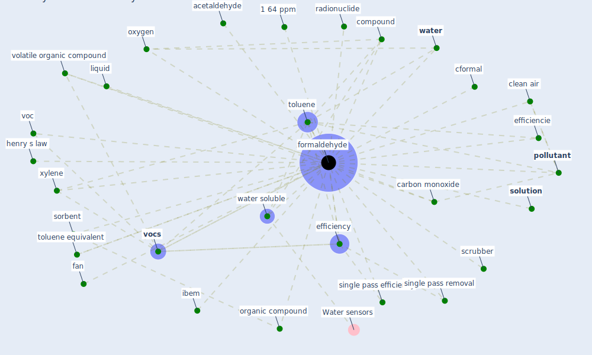

# Keyword: formaldehyde

## Keywords

 * 1 64 ppm, acetaldehyde, air clean, [air pollutant](keyword_air_pollutant), [air pollution](keyword_air_pollution), background level, benzene, carbon monoxide, cformal, clean air, compound, efficiencie, efficiency, fan, [formaldehyde](keyword_formaldehyde), henry s law, [ibem](keyword_ibem), liquid, normalize formaldehyde concentration, organic compound, oxygen, [pollutant](keyword_pollutant), radionuclide, scrubber, single pass efficiency, single pass removal, [solution](keyword_solution), sorbent, [toluene](keyword_toluene), toluene equivalent, voc, [vocs](keyword_vocs), volatile organic compound, [water](keyword_water), water soluble, xylene

## Mapping

## Neighbours

### Closest articles

* Characterization and performance evaluation of a full-scale activated carbon-based dynamic botanical air filtration system for improving indoor air quality - [LINK](article_wang_characterization_2011)
* COVID-19 Higher Mortality in Chinese Regions With Chronic Exposure to Lower Air Quality - [LINK](article_pansini_covid-19_2021)
* Disinfection technology of hospital wastes and wastewater: Suggestions for disinfection strategy during coronavirus Disease 2019 (COVID-19) pandemic in China - [LINK](article_wang_disinfection_2020)
* Continuous IEQ monitoring system: Context and development - [LINK](article_parkinson_continuous_2019)
* The contribution of green buildings in the fight against COVID-19 - [LINK](article_world_green_building_council_contribution_2020)
* An Intelligent IEQ Monitoring and Feedback System: Development and Applications - [LINK](article_geng_intelligent_2021)

### Closest BPs

