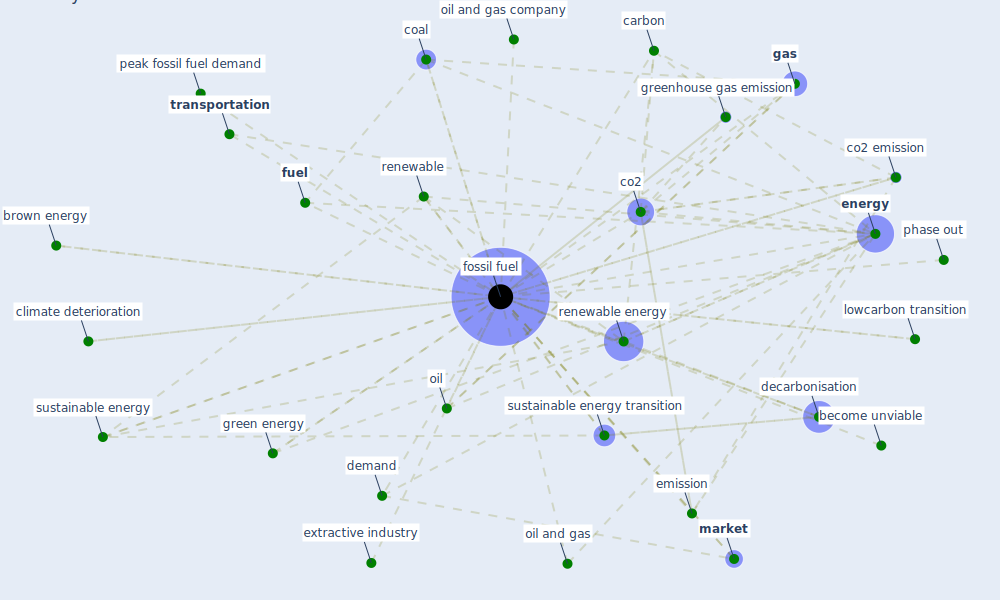

# Keyword: fossil fuel

## Keywords

 * become unviable, brown energy, carbon, climate deterioration, co2, co2 emission, coal, decarbonisation, demand, divestment, emission, emission factor, [energy](keyword_energy), [environment](keyword_environment), extractive industry, [fossil fuel](keyword_fossil_fuel), fossil fuel subj ustainable energy, fossil fuels, [fuel](keyword_fuel), [gas](keyword_gas), green energy, greenhouse gas, greenhouse gas emission, harm cause by fossil fuel, human activity contribute to the change, lowcarbon transition, [market](keyword_market), oil, oil and gas, oil and gas company, peak fossil fuel demand, phase out, renewable, renewable energy, sustainable energy, [sustainable energy transition](keyword_sustainable_energy_transition), [transportation](keyword_transportation), transportation system

## Mapping

## Neighbours

### Closest articles

* Covid-19 and the politics of sustainable energy transitions - [LINK](article_kuzemko_covid-19_2020)
* Nurture to nature via COVID-19, a self-regenerating environmental strategy of environment in global context - [LINK](article_paital_nurture_2020)
* Contextualizing the Covid-19 pandemic for a carbon-constrained world: Insights for sustainability transitions, energy justice, and research methodology - [LINK](article_sovacool_contextualizing_2020)
* The COVID-19 pandemic: Lessons on building more equal and sustainable societies - [LINK](article_van_barneveld_covid-19_2020)
* Coronavirus and Climate Change - [LINK](article_harvard_th_chan_schoold_of_public_health_coronavirus_2020)
* A critical analysis of the impacts of COVID-19 on the global economy and ecosystems and opportunities for circular economy strategies - [LINK](article_ibn-mohammed_critical_2021)
* A comprehensive review on indoor air quality monitoring systems for enhanced public health - [LINK](article_saini_comprehensive_2020)
* COVID-19 Pandemic: Rethinking Strategies for Resilient Urban Design, Perceptions, and Planning - [LINK](article_afrin_covid-19_2021)
* Ten questions concerning occupant health in buildings during normal operations and extreme events including the COVID-19 pandemic - [LINK](article_awada_ten_2021)
* COVID-19 and the UN Sustainable Development Goals: Threat to Solidarity or an Opportunity? - [LINK](article_leal_filho_covid-19_2020)

### Closest BPs

