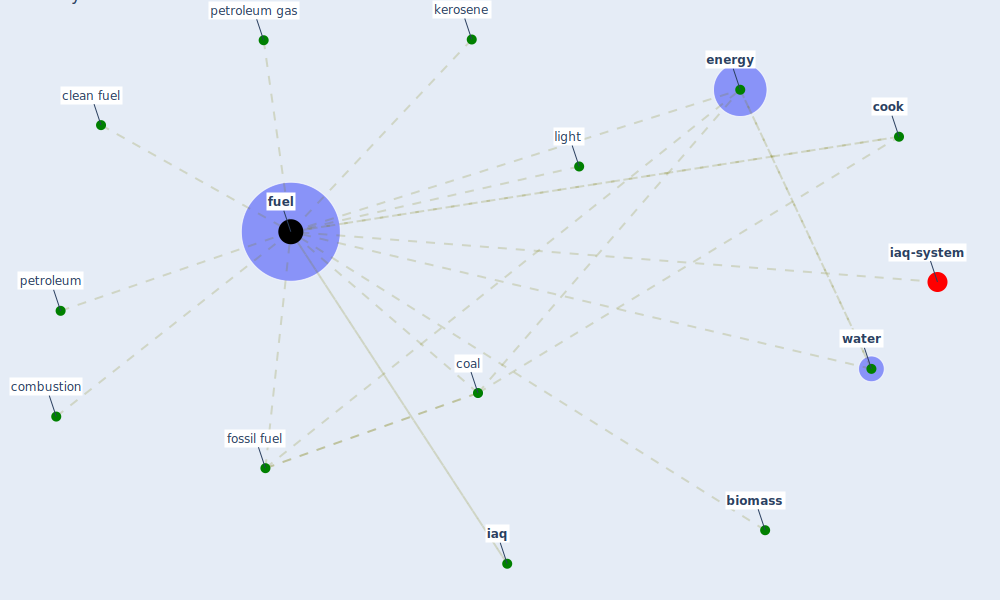

# Keyword: fuel

* [iaq-system](cluster_3)

## Keywords

 * Cluster_3, [biomass](keyword_biomass), clean fuel, coal, combustion, [cook](keyword_cook), [energy](keyword_energy), [fossil fuel](keyword_fossil_fuel), [fuel](keyword_fuel), fuels, [iaq](keyword_iaq), kerosene, light, petroleum, petroleum gas, [water](keyword_water)

## Mapping

## Neighbours

### Closest articles

* A comprehensive review on indoor air quality monitoring systems for enhanced public health - [LINK](article_saini_comprehensive_2020)
* How COVID-19 Could Accelerate the Adoption of New Retail Technologies and Enhance the (E-)Servicescape - [LINK](article_willems_how_2021)
* A critical analysis of the impacts of COVID-19 on the global economy and ecosystems and opportunities for circular economy strategies - [LINK](article_ibn-mohammed_critical_2021)
* Nurture to nature via COVID-19, a self-regenerating environmental strategy of environment in global context - [LINK](article_paital_nurture_2020)
* Proximity and post-COVID-19 urban development: Reflections from Milan, Italy - [LINK](article_tricarico_proximity_2021)

### Closest BPs

