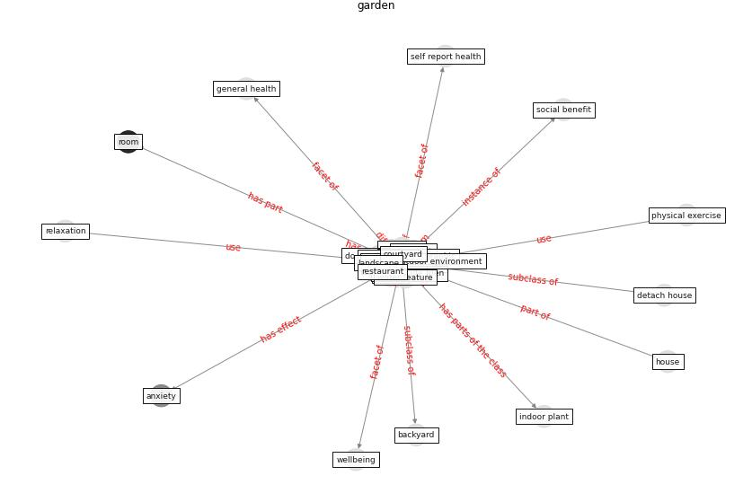

# Keyword: garden

* [health-mental](cluster_Cluster_15)

## Keywords

 * Cluster_15, allotment, [anxiety](keyword_anxiety), backyard, [balcony](keyword_balcony), balcony garden, countryside, courtyard, do mestic garden, external, [garden](keyword_garden), [gardening](keyword_gardening), gardening tool, gardens, green area, [green roof](keyword_green_roof), [green space](keyword_green_space), greenery, greenhouse, greenspace, [health](keyword_health), health datum, herb garden, [home](keyword_home), home environment, hortic, [house](keyword_house), houseplant, indoor plant, landscape, mestic garden, [nature](keyword_nature), outdoor space, park, patio, plan the world, relax, relaxation, restaurant, restorativeness, rooftop garden, [room](keyword_room), self isolation space, self report health, sky garden, sociodemographic, soil, terrace, [urban](keyword_urban), urban garden, urban greenspace, useable green area, water feature, [wellbee](keyword_wellbee), window garden, yard

## Concepts

 

## Neighbours

### Closest articles

* Home garden use during COVID-19: Associations with physical and mental wellbeing in older adults - [LINK](article_corley_home_2021)
* Towards Resilient Residential Buildings and Neighborhoods in Light of COVID-19 Pandemic—The Scenario of Podgorica, Montenegro - [LINK](article_bojovic_towards_2022)
* Assessment method for new sustainability indicators providing pandemic resilience for residential buildings - [LINK](article_tokazhanov_assessment_2021)
* The role of green roofs in post COVID-19 confinement: An analysis of willingness to pay - [LINK](article_manso_role_2021)
* Prophylactic Architecture: Formulating the Concept of Pandemic-Resilient Homes - [LINK](article_elrayies_prophylactic_2022)
* COVID-19 and Green Housing: A Review of Relevant Literature - [LINK](article_kaklauskas_covid-19_2021)
* Health, Wellbeing \& Productivity in Offices - [LINK](article_world_green_building_council_health_2014)
* Readiness Assessment of Green Building Certification Systems for Residential Buildings during Pandemics - [LINK](article_tleuken_readiness_2021)
* How to Make Green Building Certification &amp; Rating Systems More Pandemic-Sustainable? - [LINK](article_ujikawa_how_2022)
* Designing for COVID-2x: Reflecting on Future-Proofing Human Habitation for the Inevitable Next Pandemic - [LINK](article_spennemann_designing_2022)

### Closest BPs

