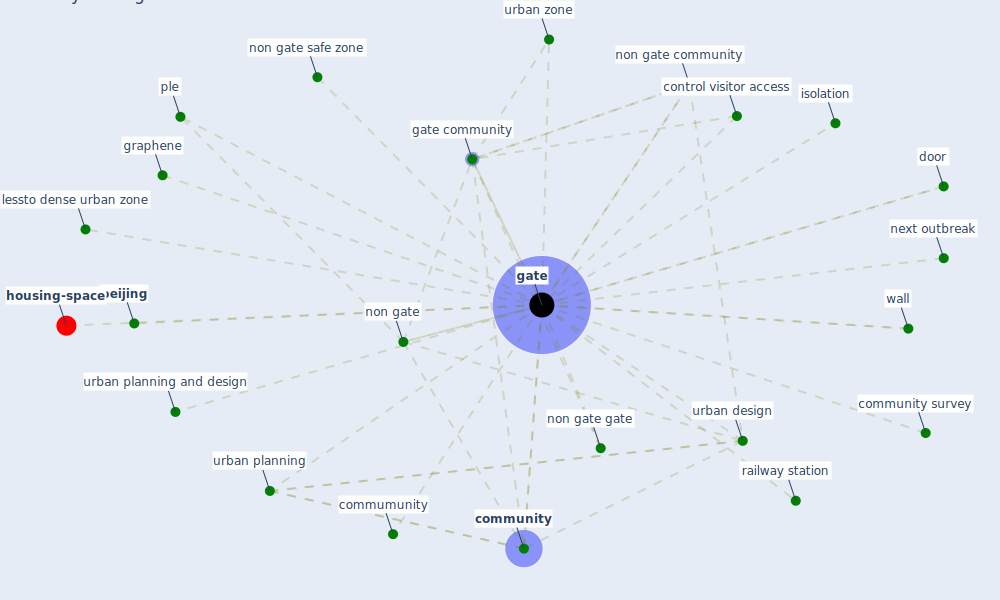

# Keyword: gate

* [housing-space](cluster_14)

## Keywords

 * Cluster_14, [beijing](keyword_beijing), commumunity, [community](keyword_community), community survey, control visitor access, door, [gate](keyword_gate), [gate community](keyword_gate_community), gated, gates, [graphene](keyword_graphene), isolation, lessto dense urban zone, next outbreak, non gate, [non gate community](keyword_non_gate_community), non gate gate, non gate safe zone, ple, [railway station](keyword_railway_station), urban design, [urban planning](keyword_urban_planning), urban planning and design, urban zone, wall

## Mapping

## Neighbours

### Closest articles

* Housing Experience in Gated Communities in the Time of Pandemics: Lessons Learned from COVID-19 - [LINK](article_asfour_housing_2022)
* Smart buildings: how a virus might lead to healthier buildings - Arup - [LINK](article_lam_smart_2021)
* Wastewater-Based Epidemiology to monitor COVID-19 outbreak: Present and future diagnostic methods to be in your radar - [LINK](article_barcelo_wastewater-based_2020)
* Association of built environment attributes with the spread of COVID-19 at its initial stage in China - [LINK](article_li_association_2021)
* From Viral City to Smart City: Learning from Pandemic Experiences - [LINK](article_sakellarides_viral_2020)

### Closest BPs

