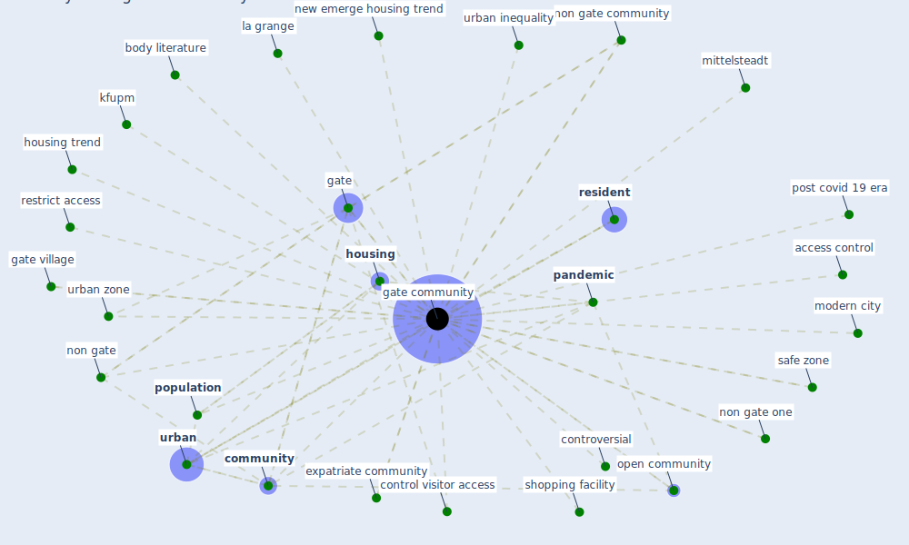

# Keyword: gate community

## Keywords

 * access control, body literature, [city](keyword_city), [community](keyword_community), control visitor access, controversial, [covid-19](keyword_covid-19), crossref la grange, expatriate, expatriate community, [gate](keyword_gate), [gate community](keyword_gate_community), gate village, gated communities, gated community, [housing](keyword_housing), housing preference, housing trend, [kfupm](keyword_kfupm), la grange, less dense urban zone, mittelsteadt, modern city, [neighborhood](keyword_neighborhood), new emerge housing trend, non gate, [non gate community](keyword_non_gate_community), non gate gate, non gate one, open community, open neighborhood, [pandemic](keyword_pandemic), [population](keyword_population), population opt for move, post covid 19 era, recreation facility, [resident](keyword_resident), restrict access, safe zone, [shanghai](keyword_shanghai), shopping facility, [urban](keyword_urban), urban inequality, urban zone

## Mapping

## Neighbours

### Closest articles

* Housing Experience in Gated Communities in the Time of Pandemics: Lessons Learned from COVID-19 - [LINK](article_asfour_housing_2022)
* Prophylactic Architecture: Formulating the Concept of Pandemic-Resilient Homes - [LINK](article_elrayies_prophylactic_2022)
* The Impact of COVID-19 on Public Space: A Review of the Emerging Questions - [LINK](article_honey-roses_impact_2020)

### Closest BPs

