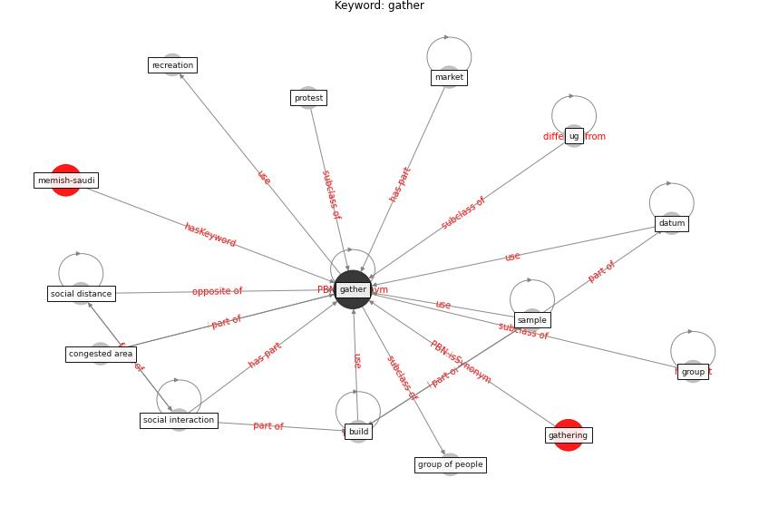

# Keyword: gather

* [memish-saudi](cluster_Cluster_8)

## Keywords

 * Cluster_8, [build](keyword_build), congested area, [datum](keyword_datum), [gather](keyword_gather), gathering, group, group of people, market, protest, recreation, [sample](keyword_sample), [social distance](keyword_social_distance), [social interaction](keyword_social_interaction), [ug](keyword_ug)

## Concepts

 

## Neighbours

### Closest articles

* A critical review of heating, ventilation, and air conditioning (HVAC) systems within the context of a global SARS-CoV-2 epidemic - [LINK](article_elsaid_critical_2021)
* Towards Resilient Residential Buildings and Neighborhoods in Light of COVID-19 Pandemic—The Scenario of Podgorica, Montenegro - [LINK](article_bojovic_towards_2022)
* COVID19-Routes: A Safe Pedestrian Navigation Service - [LINK](article_cantarero_covid19-routes_2021)
* The Emergence of Anti-Privacy and Control at the Nexus between the Concepts of Safe City and Smart City - [LINK](article_allam_emergence_2019)
* Study of COVID-19 pandemic in London (UK) from urban context - [LINK](article_ghosh_study_2020)
*  - [LINK](article_mehtab_alam_role_2021)
* The City Under COVID‐19: Podcasting As Digital Methodology - [LINK](article_rogers_city_2020)
* Effects of the COVID-19 pandemic on the use and perceptions of urban green space: An international exploratory study - [LINK](article_ugolini_effects_2020)
* The contribution of green buildings in the fight against COVID-19 - [LINK](article_world_green_building_council_contribution_2020)

### Closest BPs

