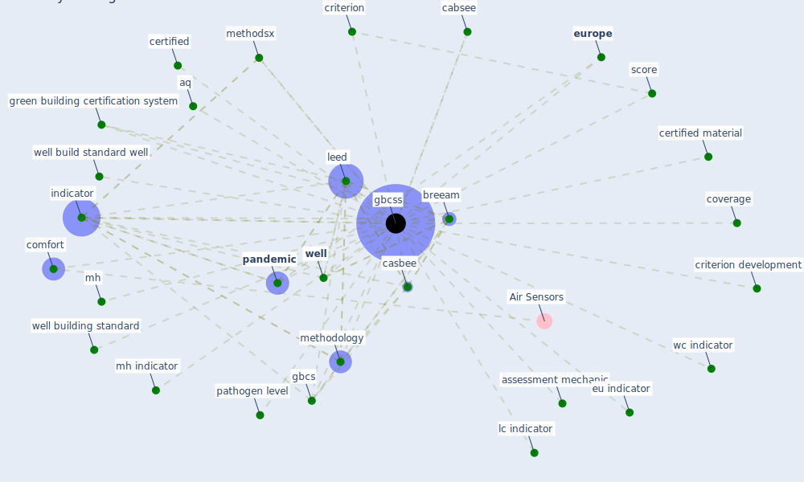

# Keyword: gbcss

## Keywords

 * aq, assessment mechanic, [breeam](keyword_breeam), cabsee, casbee, certified, certified material, comfort, coverage, criterion, criterion development, eu indicator, [europe](keyword_europe), gbcs, [gbcss](keyword_gbcss), green building certification, green building certification system, [indicator](keyword_indicator), lc indicator, [leed](keyword_leed), methodology, methodsx, mh, mh indicator, [pandemic](keyword_pandemic), pathogen level, score, wc indicator, [well](keyword_well), well build standard well, well building standard

## Mapping

## Neighbours

### Closest articles

* Assessment method for new sustainability indicators providing pandemic resilience for residential buildings - [LINK](article_tokazhanov_assessment_2021)
* Readiness Assessment of Green Building Certification Systems for Residential Buildings during Pandemics - [LINK](article_tleuken_readiness_2021)
* COVID-19 and Green Housing: A Review of Relevant Literature - [LINK](article_kaklauskas_covid-19_2021)

### Closest BPs

