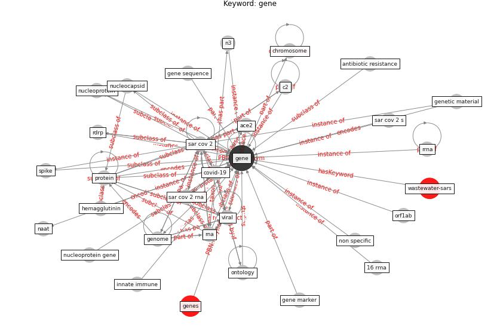

# Keyword: __gene__
## Clusters

* Cluster 12: [wastewater-sars](cluster_12)

## Concepts

 

## Top 10 articles for __gene__
* Detection of SARS-CoV-2 in raw and treated wastewater
in Germany – Suitability for COVID-19 surveillance
and potential transmission risks ([westhaus_detection_2021](article_westhaus_detection_2021))
* Presence of SARS-Coronavirus-2 RNA in Sewage and
Correlation with Reported COVID-19 Prevalence in
the Early Stage of the Epidemic in The
Netherlands ([medema_presence_2020](article_medema_presence_2020))
* SARS-CoV-2 Titers in Wastewater Are Higher
than Expected from Clinically Confirmed Cases ([wu_sars-cov-2_2020](article_wu_sars-cov-2_2020))
* Future perspectives of wastewater-based epidemiology:
Monitoring infectious disease spread and resistance to
the community level ([sims_future_2020](article_sims_future_2020))
* CIDO, a community-based ontology for coronavirus disease
knowledge and data integration, sharing, and analysis ([he_cido_2020](article_he_cido_2020))
* First detection of SARS-CoV-2 in untreated wastewaters
in Italy ([la_rosa_first_2020](article_la_rosa_first_2020))
* Construction of a Linked Data Set of COVID-19
Knowledge Graphs: Development and Applications ([wang_construction_2022](article_wang_construction_2022))
* Architectural Design Drives the Biogeography of
Indoor Bacterial Communities ([kembel_architectural_2014](article_kembel_architectural_2014))
* Aerosol and Surface Distribution of Severe Acute
Respiratory Syndrome Coronavirus 2 in Hospital
Wards, Wuhan, China, 2020 ([guo_aerosol_2020](article_guo_aerosol_2020))
* Wastewater-Based Epidemiology to monitor COVID-19
outbreak: Present and future diagnostic methods to be in
your radar ([barcelo_wastewater-based_2020](article_barcelo_wastewater-based_2020))
