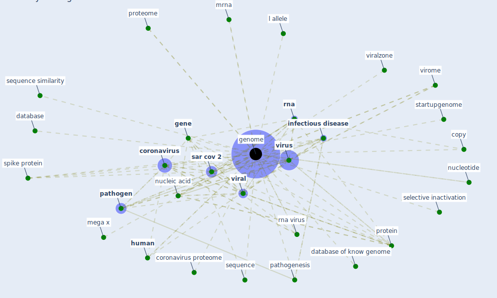

# Keyword: genome

## Keywords

 * code, copy, [coronavirus](keyword_coronavirus), coronavirus proteome, coverm, coverm make, database, database of know genome, genbank, [gene](keyword_gene), [genome](keyword_genome), genomecomposition, genomes, [human](keyword_human), [infectious disease](keyword_infectious_disease), l allele, mega x, mrna, nucleic acid, nucleotide, [pathogen](keyword_pathogen), pathogenesis, protein, proteome, [rna](keyword_rna), rna virus, [sar cov 2](keyword_sar_cov_2), selective inactivation, sequence, sequence similarity, spike protein, startupgenome, [viral](keyword_viral), viralzone, virome, [virus](keyword_virus)

## Mapping

## Neighbours

### Closest articles

* Computational analysis of SARS-CoV-2/COVID-19 surveillance by wastewater-based epidemiology locally and globally: Feasibility, economy, opportunities and challenges - [LINK](article_hart_computational_2020)
* A Comprehensive Review of the COVID-19 Pandemic and the Role of IoT, Drones, AI, Blockchain, and 5G in Managing its Impact - [LINK](article_chamola_comprehensive_2020)
* First detection of SARS-CoV-2 in untreated wastewaters in Italy - [LINK](article_la_rosa_first_2020)
* Learning from pandemics: Applying resilience thinking to identify priorities for planning urban settlements - [LINK](article_syal_learning_2021)
* SARS-CoV-2 Titers in Wastewater Are Higher than Expected from Clinically Confirmed Cases - [LINK](article_wu_sars-cov-2_2020)
* Future perspectives of wastewater-based epidemiology: Monitoring infectious disease spread and resistance to the community level - [LINK](article_sims_future_2020)
* First confirmed detection of SARS-CoV-2 in untreated wastewater in Australia: A proof of concept for the wastewater surveillance of COVID-19 in the community - [LINK](article_ahmed_first_2020)
* Far-UVC light (222 nm) efficiently and safely inactivates airborne human coronaviruses - [LINK](article_buonanno_far-uvc_2020)
* Current knowledge of COVID-19: Advances, challenges and future perspectives - [LINK](article_wu_current_2021)
* How can airborne transmission of COVID-19 indoors be minimised? - [LINK](article_morawska_how_2020)

### Closest BPs

