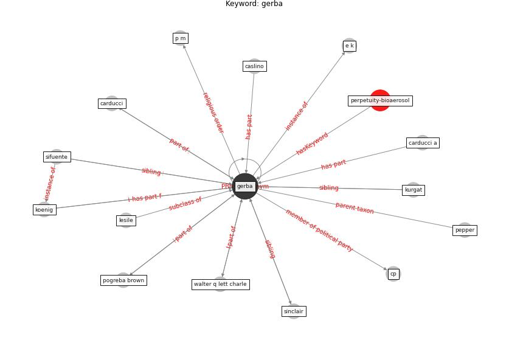

# Keyword: __gerba__
## Clusters

* Cluster 11: [surface-coating](cluster_11.md)

## Concepts

 

## Articles
* A Continuously Active Antimicrobial Coating
effective against Human Coronavirus 229E ([ikner_continuously_2020](article_ikner_continuously_2020.md))
* COVID-19 Experience Transforming the Protective
Environment of Office Buildings and Spaces ([phapant_covid-19_2021](article_phapant_covid-19_2021.md))
* COVID-19 Experience Transforming the Protective
Environment of Office Buildings and Spaces ([phapant_covid-19_2021](article_phapant_covid-19_2021.md))
* First detection of SARS-CoV-2 in untreated wastewaters
in Italy ([la_rosa_first_2020](article_la_rosa_first_2020.md))
* Computational analysis of SARS-CoV-2/COVID-19
surveillance by wastewater-based epidemiology locally and
globally: Feasibility, economy, opportunities and
challenges ([hart_computational_2020](article_hart_computational_2020.md))
* The COVID-19 pandemic: Impacts on cities and major
lessons for urban planning, design, and management ([sharifi_covid-19_2020](article_sharifi_covid-19_2020.md))
* DeepSOCIAL: Social Distancing Monitoring and
Infection Risk Assessment in COVID-19 Pandemic ([rezaei_deepsocial_2020](article_rezaei_deepsocial_2020.md))
* DeepSOCIAL: Social Distancing Monitoring and
Infection Risk Assessment in COVID-19 Pandemic ([rezaei_deepsocial_2020](article_rezaei_deepsocial_2020.md))
* DeepSOCIAL: Social Distancing Monitoring and
Infection Risk Assessment in COVID-19 Pandemic ([rezaei_deepsocial_2020](article_rezaei_deepsocial_2020.md))
* DeepSOCIAL: Social Distancing Monitoring and
Infection Risk Assessment in COVID-19 Pandemic ([rezaei_deepsocial_2020](article_rezaei_deepsocial_2020.md))
