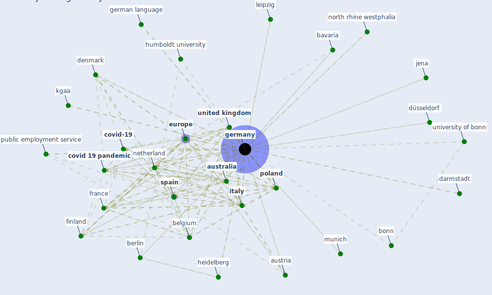

# Keyword: germany

## Keywords

 * 209 ncov infection, arbeiten 4 0, [australia](keyword_australia), [austria](keyword_austria), baden wuerttemberg, bavaria, bavarian, bavarian public parks, belgium, [berlin](keyword_berlin), bielefeld, bonn, brandenburg, [china](keyword_china), [city](keyword_city), codetermination legislation, cologne, coronavirus infection nationwide, [country](keyword_country), covid 19 outbreak, [covid 19 pandemic](keyword_covid_19_pandemic), [covid-19](keyword_covid-19), darmstadt, [denmark](keyword_denmark), draft law for preventive restructuring procedure in germany, düren, düsseldorf, ec, enr, eschborn, [europe](keyword_europe), european, european city, [european union](keyword_european_union), [finland](keyword_finland), first wave, [france](keyword_france), frankfurt, frankfurt be main, german language, german national, [germany](keyword_germany), gertner, heidelberg, herrenberg, hilden, humboldt university, imf, [italy](keyword_italy), italy57, jena, kgaa, [korea](keyword_korea), kugler, köhler, köln, königsberg, lebensreform, leipzig, liefere, low saxony, lübeck, melitta, mhfw, mini job, ministry of culture and science, munich, [netherland](keyword_netherland), nibelungen, north rhine westphalia, nürnberg, [pandemic](keyword_pandemic), penalty tax, pflugersdorf, [poland](keyword_poland), prussia, public employment service, retirement age, robert koch institut, service sector, [slovenia](keyword_slovenia), [south korea](keyword_south_korea), [spain](keyword_spain), state fund short time work allowance, stuttgart, [sweden](keyword_sweden), [taiwan](keyword_taiwan), testo, the most recent example, uk102, [united kingdom](keyword_united_kingdom), [united states](keyword_united_states), university of bonn, [usa](keyword_usa), wegebau, wernigerode, westhau, wien, woman, zweibrücken

## Mapping

## Neighbours

### Closest articles

* Sustainable work throughout the life course: National policies and strategies, Publications Office of the European Union - [LINK](article_eurofund_sustainable_2016)
* The socio-economic determinants of COVID-19: A spatial analysis of German county level data - [LINK](article_ehlert_socio-economic_2021)
* 2020 Data Protection Report - [LINK](article_council_of_europe_2020_2020)
* Refleksioner fra en pandemi - [LINK](article_realdania_refleksioner_2022)
* Covid-19 and asset management in EU: a preliminary assessment of performance and investment styles - [LINK](article_rizvi_covid-19_2020)
* Green infrastructure through the lens of “One Health”: A systematic review and integrative framework uncovering synergies and trade-offs between mental health and wildlife support in cities - [LINK](article_felappi_green_2020)
* What has been the impact of the COVID-19 pandemic on immigrants? An update on recent evidence - [LINK](article_oecd_what_2022)
* How COVID-19 Could Accelerate the Adoption of New Retail Technologies and Enhance the (E-)Servicescape - [LINK](article_willems_how_2021)
* Detection of SARS-CoV-2 in raw and treated wastewater in Germany – Suitability for COVID-19 surveillance and potential transmission risks - [LINK](article_westhaus_detection_2021)
* Making green infrastructure healthier infrastructure - [LINK](article_lohmus_making_2015)

### Closest BPs

