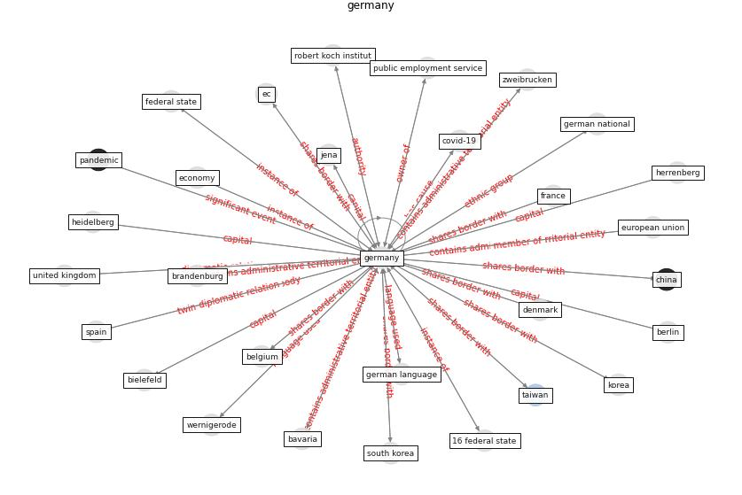

# Keyword: __germany__

## Concepts

 

## Top articles for __germany__
* yan_10_2020 ([yan_10_2020](article_yan_10_2020))
* The socio-economic determinants of COVID-19: A spatial
analysis of German county level data ([ehlert_socio-economic_2021](article_ehlert_socio-economic_2021))
* yan_10_2020 ([yan_10_2020](article_yan_10_2020))
* How COVID-19 Redefines the Concept of
Sustainability ([hakovirta_how_2020](article_hakovirta_how_2020))
* The socio-economic implications of the coronavirus
pandemic (COVID-19): A review ([nicola_socio-economic_2020](article_nicola_socio-economic_2020))
