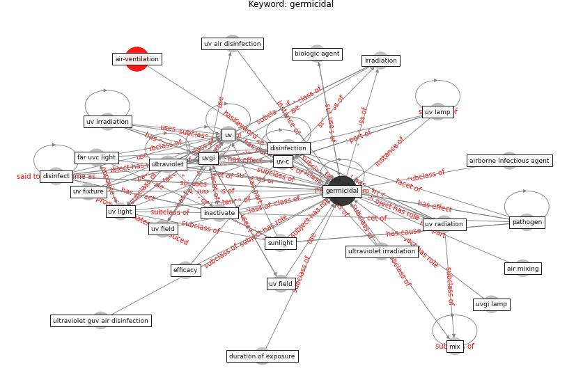

# Keyword: __germicidal__
## Clusters

* Cluster 8: [air-ventilation](cluster_8.md)

## Concepts

 

## Articles
* Methods for air cleaning and protection of building
occupants from airborne pathogens ([bolashikov_methods_2009](article_bolashikov_methods_2009.md))
* Applications of ultraviolet germicidal irradiation
disinfection in health care facilities: Effective
adjunct, but not stand-alone technology ([memarzadeh_applications_2010](article_memarzadeh_applications_2010.md))
* Methods for air cleaning and protection of building
occupants from airborne pathogens ([bolashikov_methods_2009](article_bolashikov_methods_2009.md))
* Methods for air cleaning and protection of building
occupants from airborne pathogens ([bolashikov_methods_2009](article_bolashikov_methods_2009.md))
* Air Disinfection for Airborne Infection Control
with a Focus on COVID-19: Why Germicidal UV is
Essential† ([nardell_air_2021](article_nardell_air_2021.md))
* Applications of ultraviolet germicidal irradiation
disinfection in health care facilities: Effective
adjunct, but not stand-alone technology ([memarzadeh_applications_2010](article_memarzadeh_applications_2010.md))
* Upper-room ultraviolet air disinfection might help to
reduce COVID-19 transmission in buildings: a feasibility
study ([beggs_upper-room_2020](article_beggs_upper-room_2020.md))
* How can airborne transmission of COVID-19 indoors be
minimised? ([morawska_how_2020](article_morawska_how_2020.md))
* Designing Post COVID-19 Buildings: Approaches for
Achieving Healthy Buildings ([navaratnam_designing_2022](article_navaratnam_designing_2022.md))
* Air Disinfection for Airborne Infection Control
with a Focus on COVID-19: Why Germicidal UV is
Essential† ([nardell_air_2021](article_nardell_air_2021.md))
