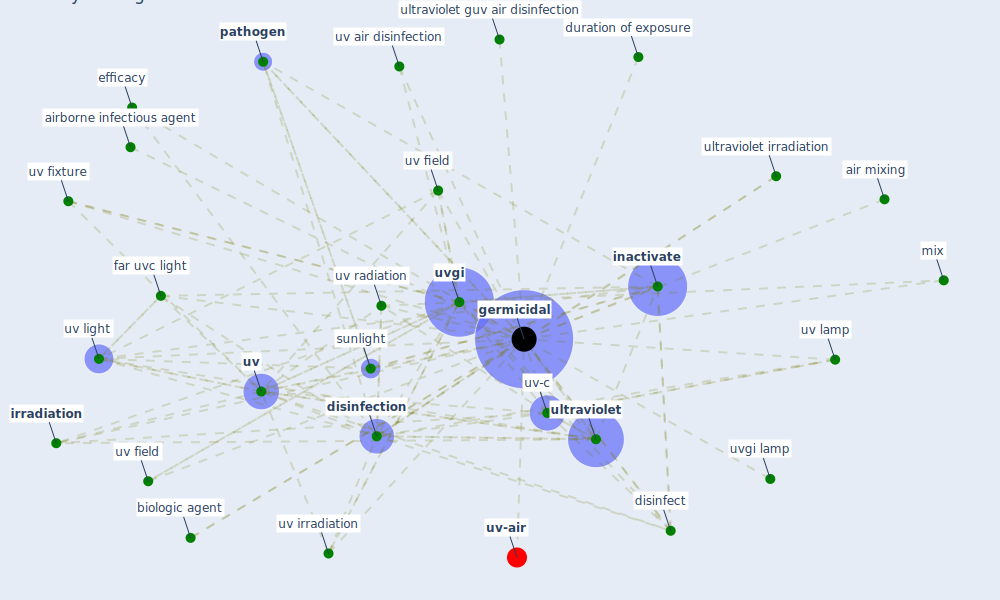

# Keyword: germicidal

* [uv-air](cluster_15)

## Keywords

 * Cluster_15, air mixing, airborne contagion, airborne infectious agent, biologic agent, bioterrorism, [coronavirus](keyword_coronavirus), disinfect, [disinfection](keyword_disinfection), duration of exposure, efficacy, erythemal, far uvc, far uvc light, fluence, [germicidal](keyword_germicidal), [graphene](keyword_graphene), [inactivate](keyword_inactivate), [irradiation](keyword_irradiation), mix, [pathogen](keyword_pathogen), sunlight, [ultraviolet](keyword_ultraviolet), ultraviolet guv air disinfection, ultraviolet irradiation, [uv](keyword_uv), uv air disinfection, uv field, uv fixture, uv irradiation, uv lamp, [uv light](keyword_uv_light), uv radiation, uv field, [uv-c](keyword_uv-c), [uvgi](keyword_uvgi), uvgi lamp, fixture

## Mapping

## Neighbours

### Closest articles

* Applications of ultraviolet germicidal irradiation disinfection in health care facilities: Effective adjunct, but not stand-alone technology - [LINK](article_memarzadeh_applications_2010)
* Methods for air cleaning and protection of building occupants from airborne pathogens - [LINK](article_bolashikov_methods_2009)
* Upper-Room Ultraviolet Light and Negative Air Ionization to Prevent Tuberculosis Transmission - [LINK](article_escombe_upper-room_2009)
* Upper-room ultraviolet air disinfection might help to reduce COVID-19 transmission in buildings: a feasibility study - [LINK](article_beggs_upper-room_2020)
* How can airborne transmission of COVID-19 indoors be minimised? - [LINK](article_morawska_how_2020)
* Air Disinfection for Airborne Infection Control with a Focus on COVID‐19: Why Germicidal UV is Essential             † - [LINK](article_nardell_air_2021)
* Far-UVC light (222 nm) efficiently and safely inactivates airborne human coronaviruses - [LINK](article_buonanno_far-uvc_2020)
* ASHRAE Position Document on Infectious Aerosols - [LINK](article_ashrae_ashrae_2022)
* A review of facilities management interventions to mitigate respiratory infections in existing buildings - [LINK](article_zhang_review_2022)
* Environmental factors involved in SARS-CoV-2 transmission: effect and role of indoor environmental quality in the strategy for COVID-19 infection control - [LINK](article_azuma_environmental_2020)

### Closest BPs

