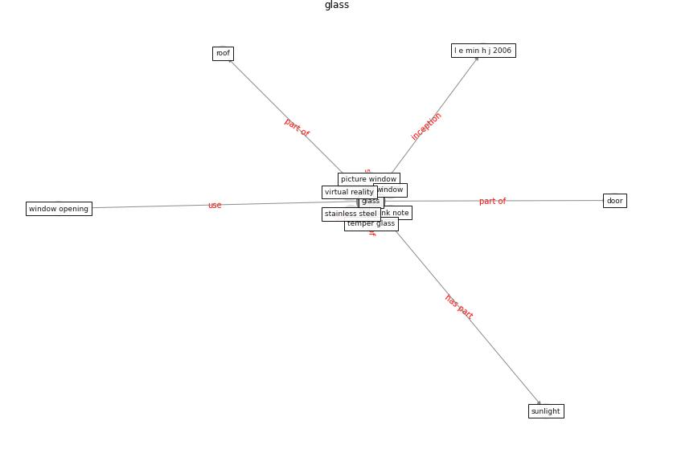

# Keyword: __glass__
## Clusters

* Cluster 11: [surface-coating](cluster_11.md)

## Concepts

 

## Articles
* A Surface Coating that Rapidly Inactivates
SARS-CoV-2 ([behzadinasab_surface_2020](article_behzadinasab_surface_2020.md))
* Significant applications of virtual reality for COVID-19
pandemic ([singh_significant_2020](article_singh_significant_2020.md))
* udomiaye_architectural_2020 ([udomiaye_architectural_2020](article_udomiaye_architectural_2020.md))
* realdania_refleksioner_2022_EN ([realdania_refleksioner_2022_EN](article_realdania_refleksioner_2022_EN.md))
* The ventilation of buildings and other mitigating measures
for COVID-19: a focus on wintertime ([burridge_ventilation_2021](article_burridge_ventilation_2021.md))
* Startups in times of crisis – A rapid response to the
COVID-19 pandemic ([kuckertz_startups_2020](article_kuckertz_startups_2020.md))
* Biophilic design in architecture and its contributions to
health, well-being, and sustainability: A critical
review ([zhong_biophilic_2022](article_zhong_biophilic_2022.md))
* COVID-19 Experience Transforming the Protective
Environment of Office Buildings and Spaces ([phapant_covid-19_2021](article_phapant_covid-19_2021.md))
* The effect of occupant distribution on energy consumption
and COVID-19 infection in buildings: A case study of
university building ([mokhtari_effect_2021](article_mokhtari_effect_2021.md))
* COVID-19 Could Leverage a Sustainable Built
Environment ([pinheiro_covid-19_2020](article_pinheiro_covid-19_2020.md))
