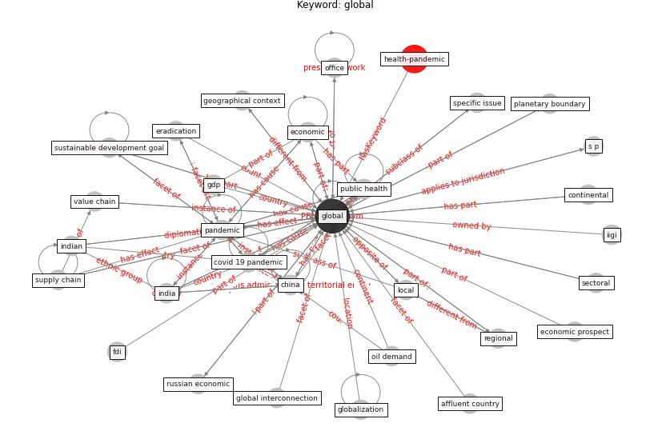

# Keyword: global

* [economic-health](cluster_Cluster_9)

## Keywords

 * Cluster_9, affluent country, aviation industry, bevægelse, [china](keyword_china), city and region, [construction industry](keyword_construction_industry), contact trace, contexts specific, continental, coronavirus epidemic, [country](keyword_country), [covid 19 crisis](keyword_covid_19_crisis), covid 19 epidemic, covid 19 lockdown, [covid 19 pandemic](keyword_covid_19_pandemic), [covid-19](keyword_covid-19), crash in demand, crash in demand from hotel and restaurant, [datum](keyword_datum), death toll, deloitte, domestic, [economic](keyword_economic), economic activity, economic challenge, economic prospect, [economy](keyword_economy), emerge economy, energy demand, environmentalchange, [epidemic](keyword_epidemic), eradication, extreme poverty, fdi, gdp, [global](keyword_global), globalization, globe, governance, green new deal, [health](keyword_health), health science, iigi, [india](keyword_india), indian, indian policy, inequality, interconnect world, interconnection, influenza pandemic, leprosy programme, local, [malaria](keyword_malaria), office, oil demand, [pandemic](keyword_pandemic), planetary boundary, polio eradication, poverty, preparedness, [public health](keyword_public_health), public health system, rapid urbanisation, regional, russian economic, s p, s p global, [sector](keyword_sector), sectoral, [shock](keyword_shock), [social](keyword_social), south, spatially homogeneous, study domain, [supply chain](keyword_supply_chain), [sustainable development goal](keyword_sustainable_development_goal), tourism economy, trade, trend, [urban governance](keyword_urban_governance), urbanisation, [urbanism](keyword_urbanism), value chain, [vbd](keyword_vbd), virome

## Concepts

 

## Neighbours

### Closest articles

* Urban planning after COVID-19 - [LINK](article_rtpi_urban_2021)
* World Bank Development Report - [LINK](article_world_bank_world_2022)
* Prototype Early Warning Systems for Vector-Borne Diseases in Europe - [LINK](article_semenza_prototype_2015)
* COVID-19 Experience Transforming the Protective Environment of Office Buildings and Spaces - [LINK](article_phapant_covid-19_2021)
* Addressing vulnerability, building resilience: community-based adaptation to vector-borne diseases in the context of global change - [LINK](article_bardosh_addressing_2017)
* A critical analysis of the impacts of COVID-19 on the global economy and ecosystems and opportunities for circular economy strategies - [LINK](article_ibn-mohammed_critical_2021)
* Building sustainable finance for resilient protected and conserved areas: lessons from COVID-19 - [LINK](article_cumming_building_2021)
* Mobility Behaviour in View of the Impact of the COVID-19 Pandemic—Public Transport Users in Gdansk Case Study - [LINK](article_przybylowski_mobility_2021)
* Designing for COVID-2x: Reflecting on Future-Proofing Human Habitation for the Inevitable Next Pandemic - [LINK](article_spennemann_designing_2022)
* COVID-19: IMPACT OF THE PANDEMIC ON THE SUSTAINABLE DEVELOPMENT GOALS - [LINK](article_samout_covid-19_2020)

### Closest BPs

