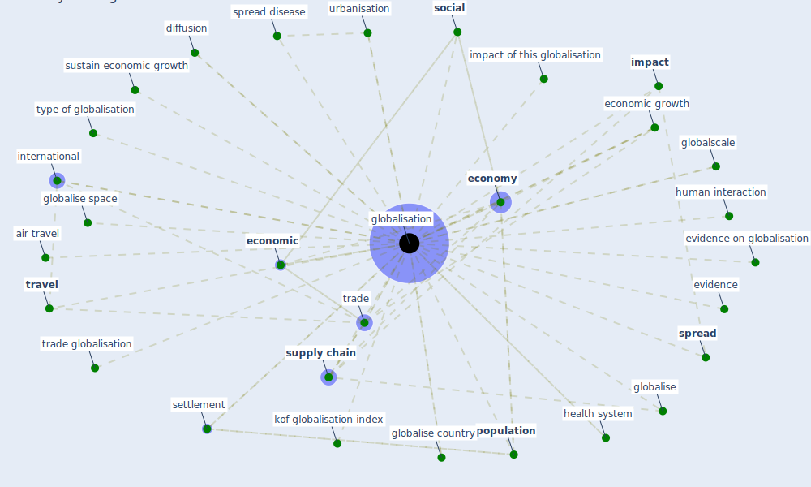

# Keyword: globalisation

## Keywords

 * air travel, de facto trade globalisation, diffusion, [economic](keyword_economic), economic growth, [economy](keyword_economy), [evidence](keyword_evidence), evidence on globalisation, [globalisation](keyword_globalisation), globalise, globalise country, globalise space, globalscale, [health system](keyword_health_system), human interaction, human settlement, [impact](keyword_impact), impact of this globalisation, international, kof globalisation index, [mobility](keyword_mobility), movement of people, neoliberal, [pandemic](keyword_pandemic), [population](keyword_population), population characteristic, [public health](keyword_public_health), settlement, [social](keyword_social), [spread](keyword_spread), spread disease, [supply chain](keyword_supply_chain), sustain economic growth, trade, trade globalisation, [travel](keyword_travel), type of globalisation, urbanisation, world city

## Mapping

## Neighbours

### Closest articles

* The Socio-Spatial Determinants of COVID-19 Diffusion: The Impact of Globalisation, Settlement Characteristics and Population - [LINK](article_sigler_socio-spatial_2020)
* Respiratory pandemics, urban planning and design: A multidisciplinary rapid review of the literature - [LINK](article_harris_respiratory_2022)
* Future perspectives of wastewater-based epidemiology: Monitoring infectious disease spread and resistance to the community level - [LINK](article_sims_future_2020)
* Mapping research in logistics and supply chain management during COVID-19 pandemic - [LINK](article_montoya-torres_mapping_2021)
* A critical analysis of the impacts of COVID-19 on the global economy and ecosystems and opportunities for circular economy strategies - [LINK](article_ibn-mohammed_critical_2021)
* Urban form: Realising the value of green space: a planners’ perspective on the COVID-19 pandemic - [LINK](article_ahmadpoor_urban_2021)
* Covid-19 and the politics of sustainable energy transitions - [LINK](article_kuzemko_covid-19_2020)
* COVID-19 Could Leverage a Sustainable Built Environment - [LINK](article_pinheiro_covid-19_2020)
* The COVID-19 pandemic: Lessons on building more equal and sustainable societies - [LINK](article_van_barneveld_covid-19_2020)

### Closest BPs

