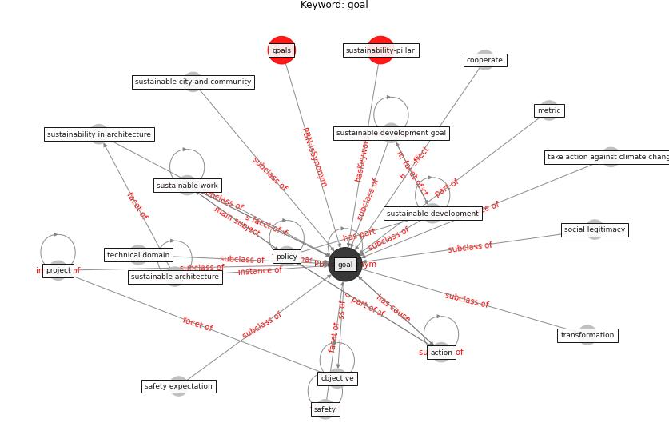

# Keyword: goal

* [sustainability-pillar](cluster_Cluster_0)

## Keywords

 * Cluster_0, action, cooperate, [goal](keyword_goal), goals, metric, objective, [policy](keyword_policy), [project](keyword_project), [safety](keyword_safety), safety expectation, social legitimacy, sustainability in architecture, [sustainable architecture](keyword_sustainable_architecture), sustainable city and community, [sustainable development](keyword_sustainable_development), [sustainable development goal](keyword_sustainable_development_goal), [sustainable work](keyword_sustainable_work), take action against climate change, technical domain, transformation

## Concepts

 

## Neighbours

### Closest articles

* Sustainable work throughout the life course: National policies and strategies, Publications Office of the European Union - [LINK](article_eurofund_sustainable_2016)
* How COVID-19 Could Accelerate the Adoption of New Retail Technologies and Enhance the (E-)Servicescape - [LINK](article_willems_how_2021)
* Exploring the Potential of Artificial Intelligence and Machine Learning to Combat COVID-19 and Existing Opportunities for LMIC: A Scoping Review - [LINK](article_naseem_exploring_2020)
* It’s time to reimagine where and how work will get done (PwC’s US Remote Work Survey) - [LINK](article_pricewaterhousecoopers_its_2021)
* Biophilic design in architecture and its contributions to health, well-being, and sustainability: A critical review - [LINK](article_zhong_biophilic_2022)
* Urban planning after COVID-19 - [LINK](article_rtpi_urban_2021)
* A Global Survey of Infection Control and Mitigation Measures for Combating the Transmission of COVID-19 Pandemic in Buildings Under Facilities Management Services - [LINK](article_sarvari_global_2022)
* Case Study on Finnish TVETA Resilient Model of Training During COVID-19 - [LINK](article_unesco_case_2021)
* Urban Community Sustainable Development Patterns under the Influence of COVID-19: A Case Study Based on the Non-Contact Interaction Perspective of Hangzhou City - [LINK](article_wang_urban_2021)
* COVID-19 and the UN Sustainable Development Goals: Threat to Solidarity or an Opportunity? - [LINK](article_leal_filho_covid-19_2020)

### Closest BPs

