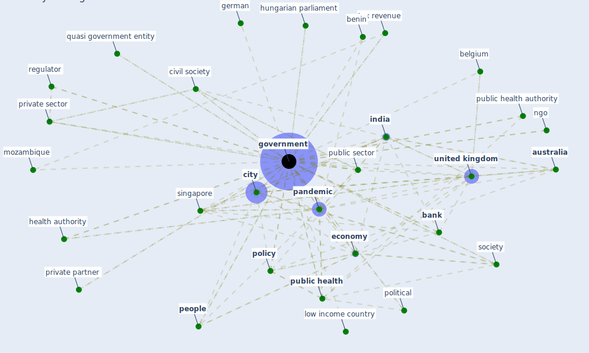

# Keyword: government

## Keywords

 * agency, agency authority, [australia](keyword_australia), [bank](keyword_bank), belgium, benin, budget, [city](keyword_city), city management, civil society, community member, construction sector, [consumer](keyword_consumer), [country](keyword_country), credit guarantee ratio, [danish](keyword_danish), department, development finance institution, [economy](keyword_economy), federal, [finland](keyword_finland), firstfood parcel deliver to clinically vulnerable people, funding, german, gov uk, [government](keyword_government), government website, govt, health authority, health care system, [hong kong](keyword_hong_kong), hungarian parliament, [india](keyword_india), institute for government, intelligence service, iran, [japan](keyword_japan), kingdom of saudi arabia, limited period of time, lithuania, [lockdown](keyword_lockdown), lockdown effort, lockdown measure, low income country, medium, member country, [member state](keyword_member_state), middle income country, mozambique, network operator, new zealand, ngo, non government body, nsw, [organization](keyword_organization), other government, [pandemic](keyword_pandemic), [people](keyword_people), philippine, [policy](keyword_policy), policy maker, policy making process, policymaker, polish, political, private firm, private partner, private sector, [public administration](keyword_public_administration), [public health](keyword_public_health), public health authority, public sector, [public transport](keyword_public_transport), quarantine measure, quasi government entity, regulation, regulator, regulatory authorities, regulatory body, republic of korea, [retailer](keyword_retailer), revenue base, role and regulation, [saudi arabia](keyword_saudi_arabia), scientific community, scottish, shelter at home decree, singapore, [smart city](keyword_smart_city), [society](keyword_society), [south korea](keyword_south_korea), [spain](keyword_spain), [state](keyword_state), state own enterprise, subnational, tax relief, tax revenue, taxpayer, [united kingdom](keyword_united_kingdom), world

## Mapping

## Neighbours

### Closest articles

* World Bank Development Report - [LINK](article_world_bank_world_2022)
* Sustainable work throughout the life course: National policies and strategies, Publications Office of the European Union - [LINK](article_eurofund_sustainable_2016)
* How COVID-19 Could Accelerate the Adoption of New Retail Technologies and Enhance the (E-)Servicescape - [LINK](article_willems_how_2021)
* A Comprehensive Review of the COVID-19 Pandemic and the Role of IoT, Drones, AI, Blockchain, and 5G in Managing its Impact - [LINK](article_chamola_comprehensive_2020)
* Mechanisms for addressing the impact of COVID-19 on infrastructure projects - [LINK](article_king_mechanisms_2021)
* Pandemic Analytics: How Countries are Leveraging Big Data Analytics and Artificial Intelligence to Fight COVID-19? - [LINK](article_mehta_pandemic_2021)
* Impact of COVID-19 on IoT Adoption in Healthcare, Smart Homes, Smart Buildings, Smart Cities, Transportation and Industrial IoT - [LINK](article_umair_impact_2021)
* COVID-ABS: An agent-based model of COVID-19 epidemic to simulate health and economic effects of social distancing interventions - [LINK](article_silva_covid-abs_2020)
* 2020 Data Protection Report - [LINK](article_council_of_europe_2020_2020)
* Urban planning after COVID-19 - [LINK](article_rtpi_urban_2021)

### Closest BPs

