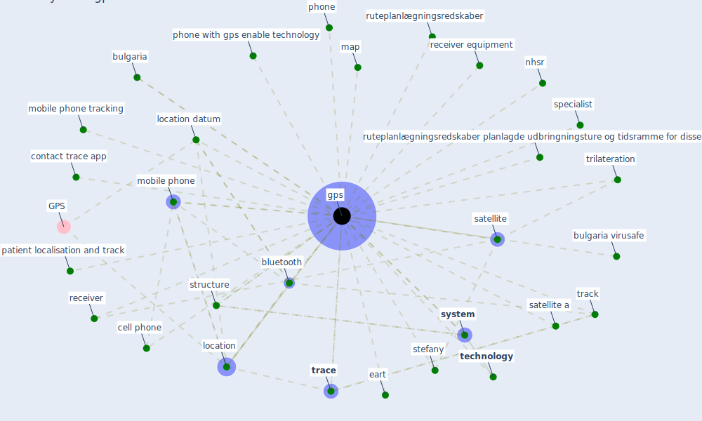

# Keyword: gps

## Keywords

 * [bluetooth](keyword_bluetooth), [bracelet](keyword_bracelet), [bulgaria](keyword_bulgaria), bulgaria virusafe, [cctv](keyword_cctv), cctv camera, cctvs, cell phone, [contact](keyword_contact), contact trace, contact trace app, contact tracking, coordinate, cross refer, [datum](keyword_datum), datum security, eart, epidemic datum, [geo](keyword_geo), geo locate, geo locate datum, [gps](keyword_gps), hard ware, [infrastructure](keyword_infrastructure), location, location datum, map, mobile phone, mobile phone tracking, nhsr, patient localisation and track, phone, phone with gps enable technology, receiver, receiver equipment, ruteplanlægningsredskaber, ruteplanlægningsredskaber planlagde udbringningsture og tidsramme for disse, satellite, satellite a, specialist, stefany, structure, [system](keyword_system), [technology](keyword_technology), [trace](keyword_trace), track, trilateration, wireless network

## Mapping

## Neighbours

### Closest articles

* Mobile Technology Solution for COVID-19: Surveillance and Prevention - [LINK](article_raza_mobile_2021)
* A Comprehensive Review of the COVID-19 Pandemic and the Role of IoT, Drones, AI, Blockchain, and 5G in Managing its Impact - [LINK](article_chamola_comprehensive_2020)
* Mental health economics: A prospective study on psychological flourishing and associations with healthcare costs and sickness benefit transfers in Denmark - [LINK](article_santini_mental_2021)
* Contributions of Smart City Solutions and Technologies to Resilience against the COVID-19 Pandemic: A Literature Review - [LINK](article_sharifi_contributions_2021)
* 2020 Data Protection Report - [LINK](article_council_of_europe_2020_2020)
* DeepSOCIAL: Social Distancing Monitoring and Infection Risk Assessment in COVID-19 Pandemic - [LINK](article_rezaei_deepsocial_2020)
* The role of 5G for digital healthcare against COVID-19 pandemic: Opportunities and challenges - [LINK](article_siriwardhana_role_2021)
* Leveraging Digital Transformation Technologies to Tackle COVID-19: Proposing a Privacy-First Holistic Framework - [LINK](article_arpaci_leveraging_2021)
* Mitigation strategies and compliance in the COVID-19 fight; how much compliance is enough? - [LINK](article_mukerjee_mitigation_2021)
* Impact of COVID-19 on IoT Adoption in Healthcare, Smart Homes, Smart Buildings, Smart Cities, Transportation and Industrial IoT - [LINK](article_umair_impact_2021)

### Closest BPs

