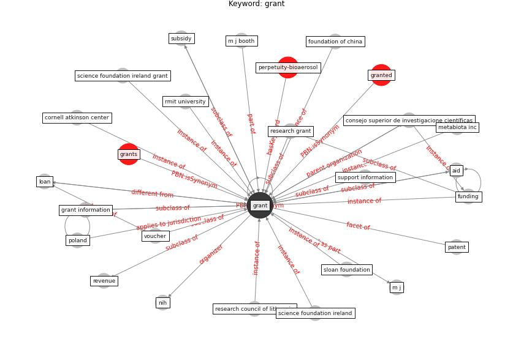

# Keyword: grant

* [perpetuity-bioaerosol](cluster_Cluster_3)

## Keywords

 * Cluster_3, aid, consejo superior de investigacione científicas, cornell atkinson center, foundation of china, funding, [grant](keyword_grant), grant information, granted, grants, loan, m j, m j booth, metabiota inc, [nih](keyword_nih), patent, [poland](keyword_poland), research council of lithuania, research grant, revenue, rmit university, science foundation ireland, science foundation ireland grant, sloan foundation, subsidy, support information, voucher

## Concepts

 

## Neighbours

### Closest articles

* Sustainable work throughout the life course: National policies and strategies, Publications Office of the European Union - [LINK](article_eurofund_sustainable_2016)
* The socio-economic implications of the coronavirus pandemic (COVID-19): A review - [LINK](article_nicola_socio-economic_2020)
* World Bank Development Report - [LINK](article_world_bank_world_2022)
* Study of COVID-19 pandemic in London (UK) from urban context - [LINK](article_ghosh_study_2020)
* Coronavirus questions that will not go away: interrogating urban and socio-spatial implications of COVID-19 measures - [LINK](article_salama_coronavirus_2020)
* A Mixed Approach on Resilience of Spanish Dwellings and Households during COVID-19 Lockdown - [LINK](article_cuerdo-vilches_mixed_2020)
* A critical analysis of the impacts of COVID-19 on the global economy and ecosystems and opportunities for circular economy strategies - [LINK](article_ibn-mohammed_critical_2021)
* COVID-19 Prevention and Control Measures in Workplace Settings: A Rapid Review and Meta-Analysis - [LINK](article_ingram_covid-19_2021)
* Effect of Ultraviolet Germicidal Irradiation on Viral Aerosols - [LINK](article_walker_effect_2007)
* Health, Economic and Social Development Challenges of the COVID-19 Pandemic: Strategies for Multiple and Interconnected Issues - [LINK](article_panneer_health_2022)

### Closest BPs

