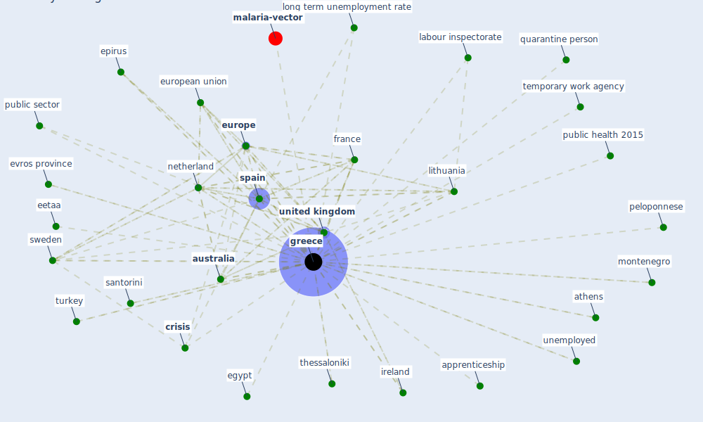

# Keyword: greece

* [malaria-vector](cluster_13)

## Keywords

 * Cluster_13, apprenticeship, athens, [australia](keyword_australia), bank specific determinant of non perform loan, [case](keyword_case), child tax credit, covid19 lockdown measure and travel behavior, [crisis](keyword_crisis), crisis hit economy, daphni, data protection legislation, data protection legislation15, distance learning, e3 network, [economic crisis](keyword_economic_crisis), eetaa, egypt, employer hire unemployed mother with at least two child can receive a subsidy, epirus, eu member state, [eurofound](keyword_eurofound), [europe](keyword_europe), [european union](keyword_european_union), eurostat, eurozone, evros province, [france](keyword_france), georgia, [government](keyword_government), [greece](keyword_greece), greek manpower employment organization, integratedpreparedness and response activities, ireland, labour inspectorate, labour inspectorate sepe, latvia, lithuania, long term unemployment, long term unemployment rate, malaria transmission, malaria transmission in greece, manpower employment organisation, [montenegro](keyword_montenegro), [netherland](keyword_netherland), oae, pandemic period, peloponnese, [poland](keyword_poland), public health 2015, public sector, quarantine, quarantine person, redundancy compensation, redundancy compensation payment, same situation, santorini, [spain](keyword_spain), [sweden](keyword_sweden), temporary work agency, the crisis, the economic crisis, the manpower employment organisation, thessaloniki, turkey, unemployed, [united kingdom](keyword_united_kingdom), university of macedonia, work hour in the public sector, work life duration

## Mapping

## Neighbours

### Closest articles

* Sustainable work throughout the life course: National policies and strategies, Publications Office of the European Union - [LINK](article_eurofund_sustainable_2016)
* Prototype Early Warning Systems for Vector-Borne Diseases in Europe - [LINK](article_semenza_prototype_2015)
* 2020 Data Protection Report - [LINK](article_council_of_europe_2020_2020)
* World Bank Development Report - [LINK](article_world_bank_world_2022)
* How the Coronavirus Will Reshape Architecture - [LINK](article_chayka_how_2020)
* How Architecture Fails in Conditions of Crisis: a Discussion on the Value of Interior Design over the COVID-19 Outbreak - [LINK](article_rassia_how_2020)
* Health Information Exchange with Blockchain amid Covid-19-like Pandemics - [LINK](article_christodoulou_health_2020)
* Startups in times of crisis – A rapid response to the COVID-19 pandemic - [LINK](article_kuckertz_startups_2020)
* Mobility Behaviour in View of the Impact of the COVID-19 Pandemic—Public Transport Users in Gdansk Case Study - [LINK](article_przybylowski_mobility_2021)
* Designing for COVID-2x: Reflecting on Future-Proofing Human Habitation for the Inevitable Next Pandemic - [LINK](article_spennemann_designing_2022)

### Closest BPs

