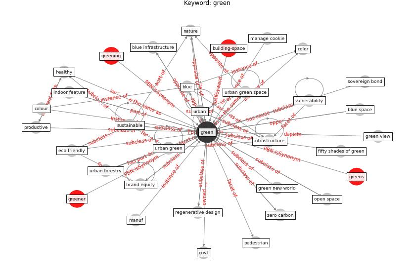

# Keyword: green

* [urban-city](cluster_Cluster_1)

* [building-space](cluster_Cluster_13)

* [health-mental](cluster_Cluster_15)

## Keywords

 * Cluster_1, Cluster_13, Cluster_15, accreditation, alternative energy source, attribute, blue, blue infrastructure, blue space, bluespace, brand equity, brown, [build](keyword_build), building council, building rating system, building standard, [chair](keyword_chair), climate action, color, color control, colour, cordon sanitaire, [covid 19 pandemic](keyword_covid_19_pandemic), [covid-19](keyword_covid-19), earth colour, eco friendly, ecologically sustainable, [energy](keyword_energy), energy saving, energy source, [environmental](keyword_environmental), fifty shades of green, [filtration](keyword_filtration), go greener feel better, govt, [green](keyword_green), green bond, green brand equity, [green building](keyword_green_building), green image, green new world, green view, greener, greenery, greening, greens, [health](keyword_health), healthy, [indoor](keyword_indoor), [indoor environment](keyword_indoor_environment), indoor feature, [infrastructure](keyword_infrastructure), issue, manage cookie, manuf, [marketing](keyword_marketing), mh1, more sustainable, [nature](keyword_nature), open space, pedestrian, preservation, productive, [public space](keyword_public_space), [recovery](keyword_recovery), red, regenerative design, restorative, sovereign bond, [sustainable](keyword_sustainable), [sustainable development](keyword_sustainable_development), sustainable instrument, sustainable project, the greener the well, transparency, university building, [urban](keyword_urban), urban forestry, urban green, [urban green space](keyword_urban_green_space), view, [vulnerability](keyword_vulnerability), watson, wolfram, zero carbon, zero carbon structure

## Concepts

 

## Neighbours

### Closest articles

* Green infrastructure through the lens of “One Health”: A systematic review and integrative framework uncovering synergies and trade-offs between mental health and wildlife support in cities - [LINK](article_felappi_green_2020)
* Association between indoor-outdoor green features and psychological health during the COVID-19 lockdown in Italy: A cross-sectional nationwide study - [LINK](article_spano_association_2021)
* How COVID-19 Could Accelerate the Adoption of New Retail Technologies and Enhance the (E-)Servicescape - [LINK](article_willems_how_2021)
* World Bank Development Report - [LINK](article_world_bank_world_2022)
* Urban Green Infrastructure and Green Open Spaces: An Issue of Social Fairness in Times of COVID-19 Crisis - [LINK](article_reinwald_urban_2021)
* The impact of the COVID-19 pandemic on the importance of urban green spaces to the public - [LINK](article_noszczyk_impact_2022)
* Biophilic design in architecture and its contributions to health, well-being, and sustainability: A critical review - [LINK](article_zhong_biophilic_2022)
* Health, Wellbeing \& Productivity in Offices - [LINK](article_world_green_building_council_health_2014)
* The effect of human mobility and control measures on the COVID-19 epidemic in China - [LINK](article_kraemer_effect_2020)
* Making green infrastructure healthier infrastructure - [LINK](article_lohmus_making_2015)

### Closest BPs

