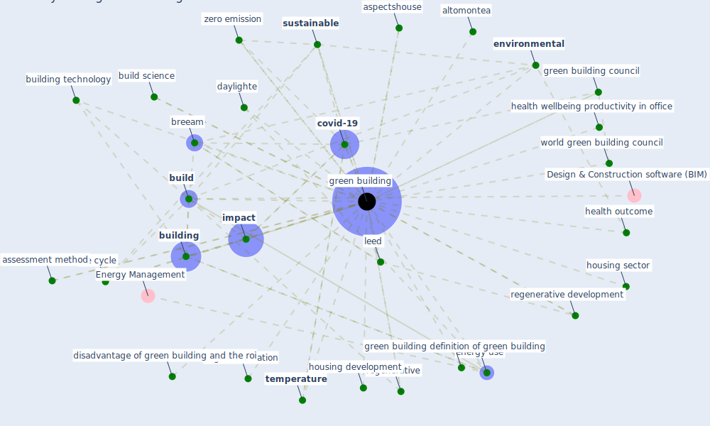

# Keyword: green building

## Keywords

 * altomontea, [architecture](keyword_architecture), asgb, asgb certification, aspectshouse, assessment method, assessment standard, [breeam](keyword_breeam), [build](keyword_build), build environ, build science, [building](keyword_building), building certification, building council, building rating, building rating system, building standard, building technology, carbon emission, certification, covid 19 situation, [covid-19](keyword_covid-19), daylighte, disadvantage of green building, disadvantage of green building and the roi, dogreen, [energy](keyword_energy), [energy efficiency](keyword_energy_efficiency), energy saving, energy use, [environment](keyword_environment), [environmental](keyword_environmental), four green building standard, [green](keyword_green), [green building](keyword_green_building), green building council, green building definition of green building, green building rating, green building rating tool, green buildings, green construction, green development, green housing topic model, green occupant, green the building, green the building the bottom line, [health](keyword_health), health and productivity, health outcome, health wellbeing productivity in office, [housing](keyword_housing), housing development, housing sector, housing sector have suffer numerous difficulty from the pandemic, housing topic model, [impact](keyword_impact), [indoor](keyword_indoor), [indoor air quality](keyword_indoor_air_quality), indoor build environ, [indoor environment](keyword_indoor_environment), [leed](keyword_leed), life cycle, life cycle of a green building, [occupant](keyword_occupant), regeneration, regenerative, regenerative approach, regenerative design, regenerative development, regenerative practice, researchgate, schiavon81, [sustainability](keyword_sustainability), [sustainable](keyword_sustainable), sustainable building, sustainable site management, [temperature](keyword_temperature), traditional, un sustainable development goal, [world green building council](keyword_world_green_building_council), zero emission

## Mapping

## Neighbours

### Closest articles

* COVID-19 and Green Housing: A Review of Relevant Literature - [LINK](article_kaklauskas_covid-19_2021)
* Navigating Climate Change: Rethinking the Role of Buildings - [LINK](article_cole_navigating_2020)
* Health, Wellbeing \& Productivity in Offices - [LINK](article_world_green_building_council_health_2014)
*  - [LINK](article_yakubu_aminu_dodo_green_2020)
* The contribution of green buildings in the fight against COVID-19 - [LINK](article_world_green_building_council_contribution_2020)
* Readiness Assessment of Green Building Certification Systems for Residential Buildings during Pandemics - [LINK](article_tleuken_readiness_2021)
* Ten questions concerning occupant health in buildings during normal operations and extreme events including the COVID-19 pandemic - [LINK](article_awada_ten_2021)
* Occupant health in buildings: Impact of the COVID-19 pandemic on the opinions of building professionals and implications on research - [LINK](article_awada_occupant_2022)
* An Intelligent IEQ Monitoring and Feedback System: Development and Applications - [LINK](article_geng_intelligent_2021)
* Biophilic design in architecture and its contributions to health, well-being, and sustainability: A critical review - [LINK](article_zhong_biophilic_2022)

### Closest BPs

