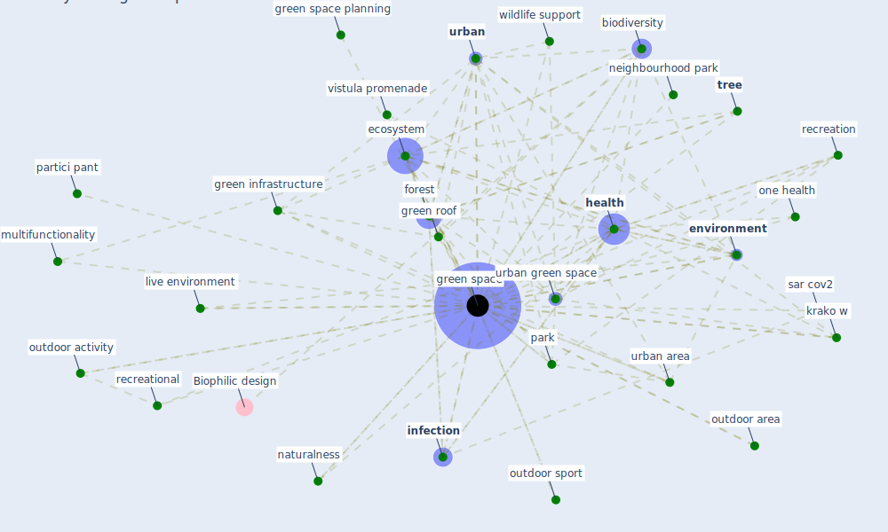

# Keyword: green space

## Keywords

 * [architecture](keyword_architecture), big park, [biodiversity](keyword_biodiversity), biophilia, [build](keyword_build), [build environment](keyword_build_environment), build hia, confine resident, conservation, [crisis](keyword_crisis), de velopment, [dog](keyword_dog), domestic garden, ecological, [ecosystem](keyword_ecosystem), [environment](keyword_environment), exercise, exercise infrastructure, [forest](keyword_forest), [garden](keyword_garden), grass, green infrastructure, green park, green park design, [green roof](keyword_green_roof), [green space](keyword_green_space), green space design and management, green space planning, green space quality, green spaces, green square, greenspace, gym, habitat, [health](keyword_health), health and safety in house, health inequity, [infection](keyword_infection), intervention, intervention method, [krako w](keyword_krako_w), land cover, live environment, mh1, multifunctionality, naturalness, neighbourhood, neighbourhood park, one health, outdoor activity, outdoor area, outdoor environment, outdoor green feature, outdoor sport, park, partici pant, place of residence, planning policies, pocket park, popu larity, quality green space, quality of green space, recreation, recreational, [sar cov2](keyword_sar_cov2), site level factors, small neighbourhood park, [stress](keyword_stress), stress level reduction, [sustainability](keyword_sustainability), trail, [tree](keyword_tree), tree canopy, [type](keyword_type), type and distribution of green space we want, type of green space, [urban](keyword_urban), urban area, urban context, urban farming, [urban green space](keyword_urban_green_space), urban green space per capita, urban park, [urban planning](keyword_urban_planning), urban restorative environment, urban restorative environments, urban wildlife support, urbanicity, vegetation, vegetation structure, verandah, view, view from above, vistula promenade, walk distance, walk the dog, [well be](keyword_well_be), [wildlife](keyword_wildlife), wildlife conservation, wildlife support

## Mapping

## Neighbours

### Closest articles

* Green spaces, especially forest, linked to lower SARS-CoV-2 infection rates: A one-year nationwide study - [LINK](article_jiang_green_2021)
* Green infrastructure through the lens of “One Health”: A systematic review and integrative framework uncovering synergies and trade-offs between mental health and wildlife support in cities - [LINK](article_felappi_green_2020)
* The impact of the COVID-19 pandemic on the importance of urban green spaces to the public - [LINK](article_noszczyk_impact_2022)
* Urban form: Realising the value of green space: a planners’ perspective on the COVID-19 pandemic - [LINK](article_ahmadpoor_urban_2021)
* The Impact of COVID-19 on Public Space: A Review of the Emerging Questions - [LINK](article_honey-roses_impact_2020)
* Association between indoor-outdoor green features and psychological health during the COVID-19 lockdown in Italy: A cross-sectional nationwide study - [LINK](article_spano_association_2021)
* Home garden use during COVID-19: Associations with physical and mental wellbeing in older adults - [LINK](article_corley_home_2021)
* Urban Green Infrastructure and Green Open Spaces: An Issue of Social Fairness in Times of COVID-19 Crisis - [LINK](article_reinwald_urban_2021)
* Health, Wellbeing \& Productivity in Offices - [LINK](article_world_green_building_council_health_2014)
* Effects of the COVID-19 pandemic on the use and perceptions of urban green space: An international exploratory study - [LINK](article_ugolini_effects_2020)

### Closest BPs

