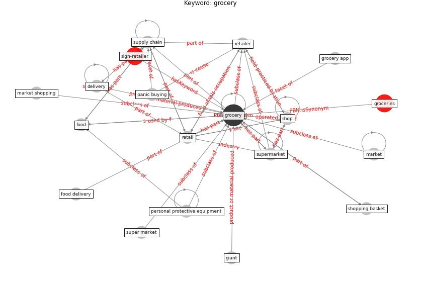

# Keyword: grocery

* [sign-retailer](cluster_Cluster_8)

## Keywords

 * Cluster_8, [delivery](keyword_delivery), food, food delivery, giant, groceries, [grocery](keyword_grocery), grocery app, market, market shopping, panic buying, [personal protective equipment](keyword_personal_protective_equipment), [retail](keyword_retail), [retailer](keyword_retailer), [shop](keyword_shop), shopping basket, super market, supermarket, [supply chain](keyword_supply_chain)

## Concepts

 

## Neighbours

### Closest articles

* How COVID-19 Could Accelerate the Adoption of New Retail Technologies and Enhance the (E-)Servicescape - [LINK](article_willems_how_2021)
* Blockchain technology and its applications to combat COVID-19 pandemic - [LINK](article_sharma_blockchain_2022)
* Questioning the use of the balcony in apartments during the COVID-19 pandemic process - [LINK](article_aydin_questioning_2020)
* Mobile Technology Solution for COVID-19: Surveillance and Prevention - [LINK](article_raza_mobile_2021)
* Mapping research in logistics and supply chain management during COVID-19 pandemic - [LINK](article_montoya-torres_mapping_2021)

### Closest BPs

