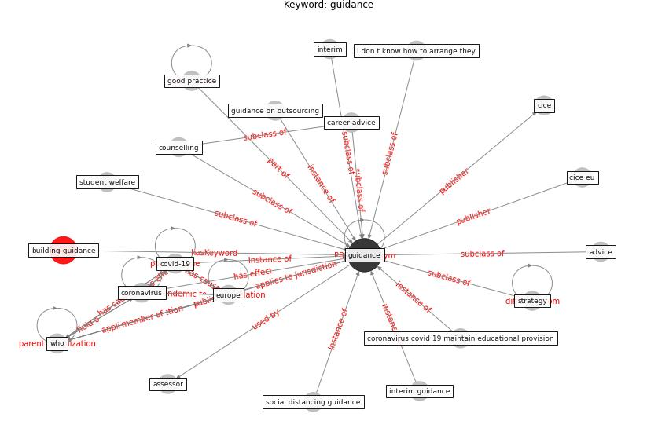

# Keyword: guidance

* [building-guidance](cluster_Cluster_15)

## Keywords

 * Cluster_15, I don t know how to arrange they, [advice](keyword_advice), [assessor](keyword_assessor), career advice, cice, cice eu, [coronavirus](keyword_coronavirus), coronavirus covid 19 maintain educational provision, counselling, [covid-19](keyword_covid-19), [europe](keyword_europe), good practice, [guidance](keyword_guidance), guidance on outsourcing, interim, interim guidance, social distancing guidance, strategy, student welfare, who

## Concepts

 

## Neighbours

### Closest articles

* How can airborne transmission of COVID-19 indoors be minimised? - [LINK](article_morawska_how_2020)
* Guidelines for resilience systems analysis - [LINK](article_oecd_guidelines_2014)
* Assessment method for new sustainability indicators providing pandemic resilience for residential buildings - [LINK](article_tokazhanov_assessment_2021)
*  - [LINK](article_dalessandro_covid-19_2020)
* Sustainable work throughout the life course: National policies and strategies, Publications Office of the European Union - [LINK](article_eurofund_sustainable_2016)
* Persistence of coronaviruses on inanimate surfaces and their inactivation with biocidal agents - [LINK](article_kampf_persistence_2020)
* COVID-19 Experience Transforming the Protective Environment of Office Buildings and Spaces - [LINK](article_phapant_covid-19_2021)
* Effects of the COVID-19 pandemic on the use and perceptions of urban green space: An international exploratory study - [LINK](article_ugolini_effects_2020)
* World Bank Development Report - [LINK](article_world_bank_world_2022)
* COVID-19 and the UN Sustainable Development Goals: Threat to Solidarity or an Opportunity? - [LINK](article_leal_filho_covid-19_2020)

### Closest BPs

