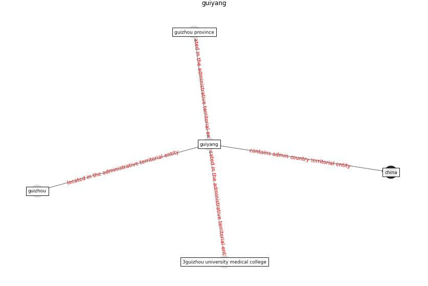

# Keyword: __guiyang__

## Concepts

 

## Top articles for __guiyang__
* CIDO, a community-based ontology for coronavirus disease
knowledge and data integration, sharing, and analysis ([he_cido_2020](article_he_cido_2020))
