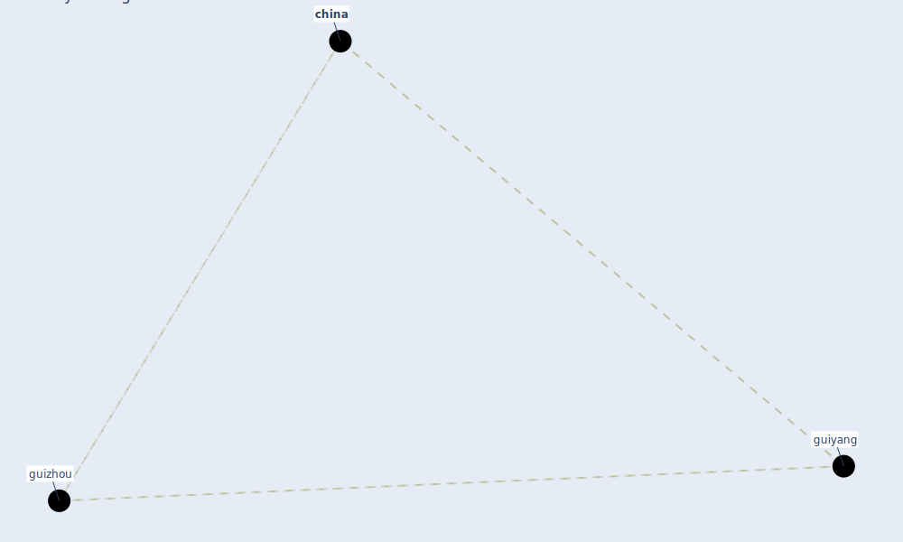

# Keyword: guizhou

## Keywords

 * [china](keyword_china), guiyang, [guizhou](keyword_guizhou)

## Mapping

## Neighbours

### Closest articles

* CIDO, a community-based ontology for coronavirus disease knowledge and data integration, sharing, and analysis - [LINK](article_he_cido_2020)

### Closest BPs

