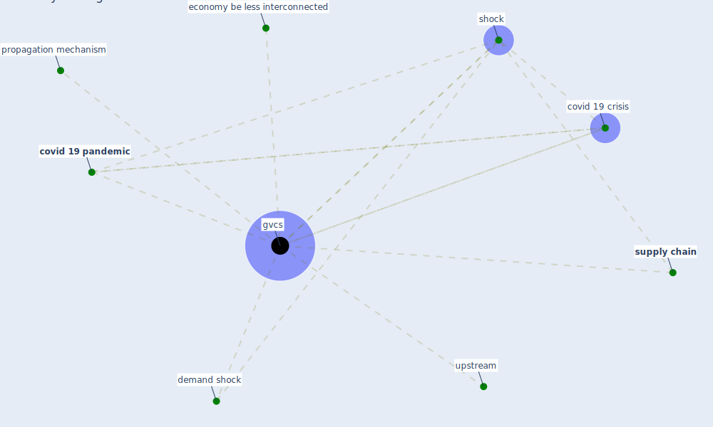

# Keyword: gvcs

## Keywords

 * [covid 19 crisis](keyword_covid_19_crisis), [covid 19 pandemic](keyword_covid_19_pandemic), demand shock, economy be less interconnected, [gvcs](keyword_gvcs), propagation mechanism, [shock](keyword_shock), [supply chain](keyword_supply_chain), upstream

## Mapping

## Neighbours

### Closest articles

* Global value chains: Efficiency and risks in the context of COVID-19 - [LINK](article_oecd_global_2021)

### Closest BPs

