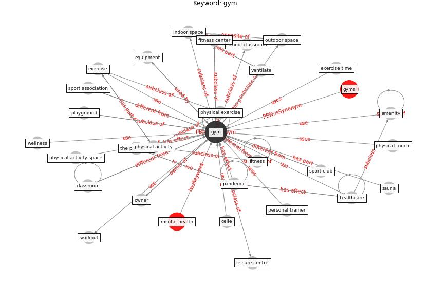

# Keyword: gym

* [mental-health](cluster_Cluster_11)

## Keywords

 * Cluster_11, amenity, aqua, celle, classroom, equipment, exercise, exercise time, [fitness](keyword_fitness), fitness center, green space, ground level, [gym](keyword_gym), gyms, [healthcare](keyword_healthcare), indoor space, leisure centre, outdoor, outdoor space, owner, [pandemic](keyword_pandemic), personal trainer, physical activity, physical activity space, physical exercise, physical touch, playground, sauna, school classroom, sport association, sport club, the pandemic, ventilate, wellness, workout

## Concepts

 

## Neighbours

### Closest articles

* How COVID-19 Could Accelerate the Adoption of New Retail Technologies and Enhance the (E-)Servicescape - [LINK](article_willems_how_2021)
* A review of facilities management interventions to mitigate respiratory infections in existing buildings - [LINK](article_zhang_review_2022)
* Health, Wellbeing \& Productivity in Offices - [LINK](article_world_green_building_council_health_2014)
* Assessment of COVID-19 precautionary measures in sports facilities: A case study on a health club in Saudi Arabia - [LINK](article_ibrahim_assessment_2022)
* The impact of the COVID-19 pandemic on the importance of urban green spaces to the public - [LINK](article_noszczyk_impact_2022)
* COVID-19 and Green Housing: A Review of Relevant Literature - [LINK](article_kaklauskas_covid-19_2021)
* Ten questions concerning occupant health in buildings during normal operations and extreme events including the COVID-19 pandemic - [LINK](article_awada_ten_2021)
* The ventilation of buildings and other mitigating measures for COVID-19: a focus on wintertime - [LINK](article_burridge_ventilation_2021)
* Assessment method for new sustainability indicators providing pandemic resilience for residential buildings - [LINK](article_tokazhanov_assessment_2021)

### Closest BPs

