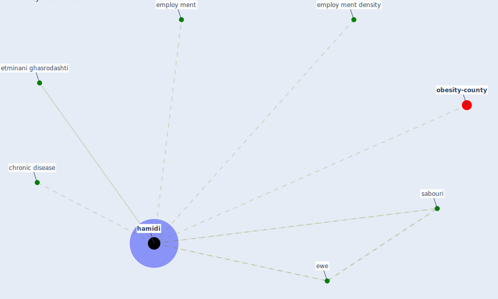

# Keyword: hamidi

* [obesity-county](cluster_9)

## Keywords

 * Cluster_9, [chronic disease](keyword_chronic_disease), employ ment, employ ment density, etminani ghasrodashti, ewe, [hamidi](keyword_hamidi), sabouri

## Mapping

## Neighbours

### Closest articles

* A Review on Building Design as a Biomedical System for Preventing COVID-19 Pandemic - [LINK](article_amran_review_2022)
* Treating two pandemics for the price of one: Chronic and infectious disease impacts of the built and natural environment - [LINK](article_frank_treating_2021)
* Association of built environment attributes with the spread of COVID-19 at its initial stage in China - [LINK](article_li_association_2021)
* Urban Community Sustainable Development Patterns under the Influence of COVID-19: A Case Study Based on the Non-Contact Interaction Perspective of Hangzhou City - [LINK](article_wang_urban_2021)

### Closest BPs

