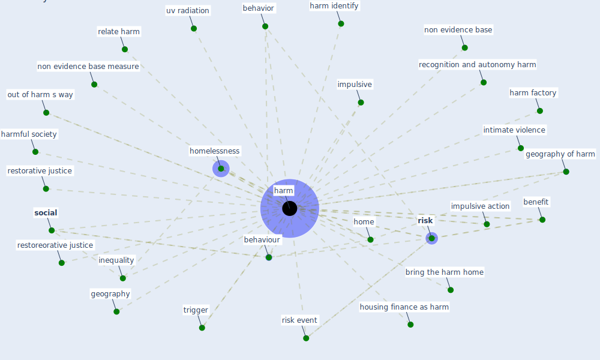

# Keyword: harm

## Keywords

 * behavior, behaviour, benefit, bring the harm home, geography, geography of harm, [harm](keyword_harm), harm factory, harm identify, harmful society, harms, [home](keyword_home), [homelessness](keyword_homelessness), housing finance as harm, impulsive, impulsive action, inequality, intimate violence, non evidence base, non evidence base measure, out of harm s way, recognition and autonomy harm, relate harm, restorative justice, restoreorative justice, [risk](keyword_risk), risk event, [social](keyword_social), trigger, uv radiation, welfare regime

## Mapping

## Neighbours

### Closest articles

* Dangerous liaisons? Applying the social harm perspective to the social inequality, housing and health trifecta during the Covid-19 pandemic - [LINK](article_gurney_dangerous_2021)
* Coronavirus disease 2019: The harms of exaggerated information and non‐evidence‐based measures - [LINK](article_ioannidis_coronavirus_2020)
* The impacts of knowledge, risk perception, emotion and information on citizens’ protective behaviors during the outbreak of COVID-19: a cross-sectional study in China - [LINK](article_ning_impacts_2020)
* ASHRAE Position Document on Infectious Aerosols - [LINK](article_ashrae_ashrae_2022)
* Eviction, Health Inequity, and the Spread of COVID-19: Housing Policy as a Primary Pandemic Mitigation Strategy - [LINK](article_benfer_eviction_2021)
* Building up an ecologically sustainable and socially desirable post-COVID-19 future - [LINK](article_duflot_building_2021)
* Amplifying the role of knowledge translation platforms in the COVID-19 pandemic response - [LINK](article_el-jardali_amplifying_2020)
* Designing Post COVID-19 Buildings: Approaches for Achieving Healthy Buildings - [LINK](article_navaratnam_designing_2022)

### Closest BPs

