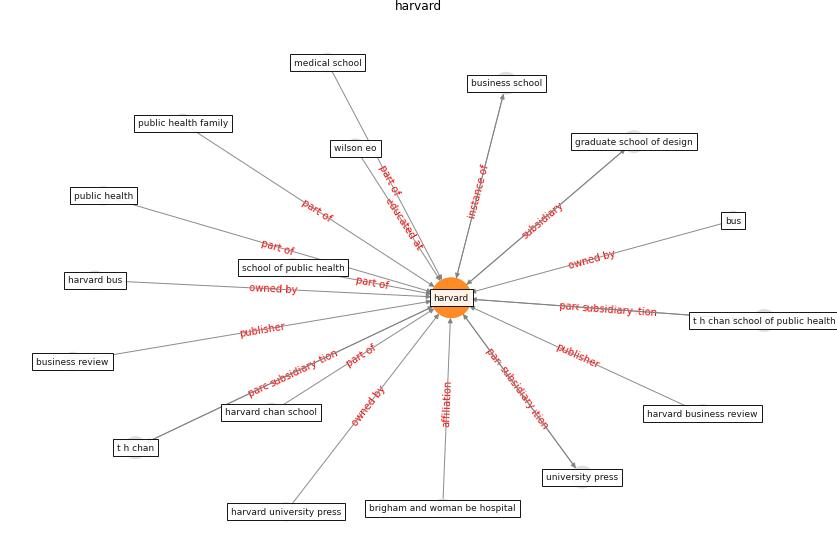

# Keyword: __harvard__
## Clusters

* Cluster 2: [construction-resilience](cluster_2.md)

## Concepts

 

## Articles
* harvard_th_chan_schoold_of_public_health_coronavirus_2020 ([harvard_th_chan_schoold_of_public_health_coronavirus_2020](article_harvard_th_chan_schoold_of_public_health_coronavirus_2020.md))
* Coronavirus questions that will not go away: interrogating
urban and socio-spatial implications of COVID-19
measures ([salama_coronavirus_2020](article_salama_coronavirus_2020.md))
* Leveraging Digital Transformation Technologies to
Tackle COVID-19: Proposing a Privacy-First
Holistic Framework ([arpaci_leveraging_2021](article_arpaci_leveraging_2021.md))
* The three modes of existence of the pandemic smart city ([soderstrom_three_2021](article_soderstrom_three_2021.md))
* When the fourth water and digital revolution encountered
COVID-19 ([poch_when_2020](article_poch_when_2020.md))
* realdania_refleksioner_2022_EN ([realdania_refleksioner_2022_EN](article_realdania_refleksioner_2022_EN.md))
* A Comprehensive Review of the COVID-19 Pandemic
and the Role of IoT, Drones, AI, Blockchain, and
5G in Managing its Impact ([chamola_comprehensive_2020](article_chamola_comprehensive_2020.md))
* world_green_building_council_health_2014-700 ([world_green_building_council_health_2014-700](article_world_green_building_council_health_2014-700.md))
* Ten questions concerning occupant health in buildings
during normal operations and extreme events including the
COVID-19 pandemic ([awada_ten_2021](article_awada_ten_2021.md))
* carvalhaes_covid-19_2020 ([carvalhaes_covid-19_2020](article_carvalhaes_covid-19_2020.md))
