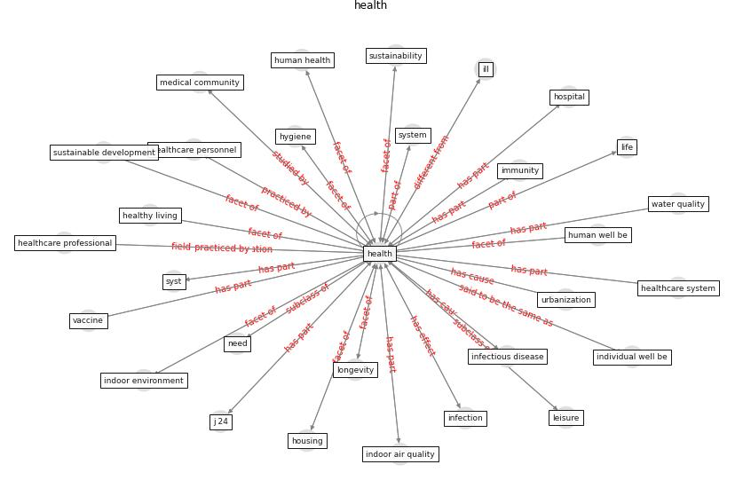

# Keyword: __health__
## Clusters

* Cluster 3: [city-spatial](cluster_3)
* Cluster 6: [construction-project](cluster_6)
* Cluster 8: [health-housing](cluster_8)
* Cluster 9: [health-building](cluster_9)
* Cluster 10: [city-smart](cluster_10)
* Cluster 11: [blockchain-ai](cluster_11)
* Cluster 12: [climate-change](cluster_12)
* Cluster 14: [resilience-system](cluster_14)
* Cluster 15: [green-urban](cluster_15)

## Concepts

 

## Top 10 articles for __health__
* world_green_building_council_health_2014 ([world_green_building_council_health_2014](article_world_green_building_council_health_2014))
* who_strengthening_2017 ([who_strengthening_2017](article_who_strengthening_2017))
* realdania_refleksioner_2022_EN ([realdania_refleksioner_2022_EN](article_realdania_refleksioner_2022_EN))
* Occupant health in buildings: Impact of the COVID-19
pandemic on the opinions of building professionals and
implications on research ([awada_occupant_2022](article_awada_occupant_2022))
* eurofund_sustainable_2016 ([eurofund_sustainable_2016](article_eurofund_sustainable_2016))
* Ten questions concerning occupant health in buildings
during normal operations and extreme events including the
COVID-19 pandemic ([awada_ten_2021](article_awada_ten_2021))
* Biophilic design in architecture and its contributions to
health, well-being, and sustainability: A critical
review ([zhong_biophilic_2022](article_zhong_biophilic_2022))
* Home garden use during COVID-19: Associations with
physical and mental wellbeing in older adults ([corley_home_2021](article_corley_home_2021))
* COVID-19 and Green Housing: A Review of
Relevant Literature ([kaklauskas_covid-19_2021](article_kaklauskas_covid-19_2021))
* A Review on Building Design as a Biomedical
System for Preventing COVID-19 Pandemic ([amran_review_2022](article_amran_review_2022))
