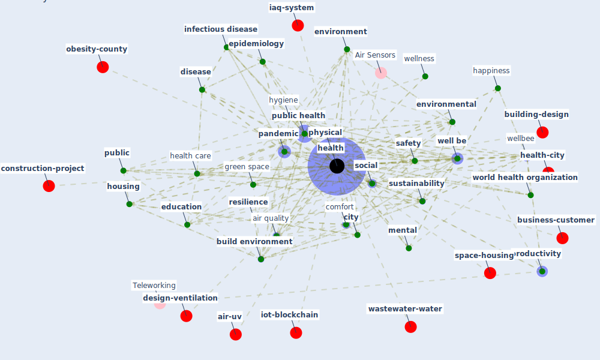

# Keyword: health

* [urban-city](cluster_1)

* [air-sars](cluster_2)

* [construction-pandemic](cluster_3)

* [housing-space](cluster_4)

* [datum-iot](cluster_5)

* [health-mental](cluster_6)

* [building-energy](cluster_9)

* [malaria-vector](cluster_10)

* [resilience-infrastructure](cluster_11)

* [china-case](cluster_13)

* [respiratory-infection](cluster_14)

## Keywords

 * [air pollution](keyword_air_pollution), air quality, [architecture](keyword_architecture), awada, behavior, [build](keyword_build), [build environment](keyword_build_environment), care, [city](keyword_city), [climate change](keyword_climate_change), climate resilience, cognitive function, [comfort](keyword_comfort), [community](keyword_community), condition, coronavirus disease covid 19, [covid 19 pandemic](keyword_covid_19_pandemic), development, diet, [disease](keyword_disease), [economic](keyword_economic), economic outcome, [education](keyword_education), [energy](keyword_energy), [environment](keyword_environment), environmental, epidemiologist, [epidemiology](keyword_epidemiology), [europe](keyword_europe), exercise, family, fitness, food system, [garden](keyword_garden), [gardening](keyword_gardening), [green space](keyword_green_space), happiness, [health](keyword_health), [health care](keyword_health_care), health inequity, health manag, health outcome, health service, [health system](keyword_health_system), [healthcare](keyword_healthcare), healthcare personnel, healthcare professional, [healthcare system](keyword_healthcare_system), [hospital](keyword_hospital), [housing](keyword_housing), [human](keyword_human), hygiene, ill, [indoor environment](keyword_indoor_environment), [infection](keyword_infection), [infectious disease](keyword_infectious_disease), life expectancy, link, longevity, [medical](keyword_medical), medicine, [mental](keyword_mental), [nature](keyword_nature), nutrition, [occupant health](keyword_occupant_health), [pandemic](keyword_pandemic), performance, [physical](keyword_physical), pollution, population density, [prevention](keyword_prevention), preventive medicine, [productivity](keyword_productivity), [psychological](keyword_psychological), psychology, [public](keyword_public), [public health](keyword_public_health), public health directive, public health emergency, [research](keyword_research), [resilience](keyword_resilience), [risk](keyword_risk), [safety](keyword_safety), [sector](keyword_sector), [security](keyword_security), [social](keyword_social), socio demographic, [stress](keyword_stress), stressful life event, [sustainability](keyword_sustainability), [sustainable development](keyword_sustainable_development), theoretical, [urban green space](keyword_urban_green_space), water quality, welfare, [well be](keyword_well_be), [wellbee](keyword_wellbee), wellness, world health organisation, [world health organization](keyword_world_health_organization)

## Mapping

## Neighbours

### Closest articles

* Health, Wellbeing \& Productivity in Offices - [LINK](article_world_green_building_council_health_2014)
* Strengthening resilience: a priority shared by Health 2020 and - [LINK](article_who_strengthening_2017)
* Occupant health in buildings: Impact of the COVID-19 pandemic on the opinions of building professionals and implications on research - [LINK](article_awada_occupant_2022)
* Sustainable work throughout the life course: National policies and strategies, Publications Office of the European Union - [LINK](article_eurofund_sustainable_2016)
* Biophilic design in architecture and its contributions to health, well-being, and sustainability: A critical review - [LINK](article_zhong_biophilic_2022)
* Ten questions concerning occupant health in buildings during normal operations and extreme events including the COVID-19 pandemic - [LINK](article_awada_ten_2021)
* Home garden use during COVID-19: Associations with physical and mental wellbeing in older adults - [LINK](article_corley_home_2021)
* COVID-19 and Green Housing: A Review of Relevant Literature - [LINK](article_kaklauskas_covid-19_2021)
* A Review on Building Design as a Biomedical System for Preventing COVID-19 Pandemic - [LINK](article_amran_review_2022)
* Green infrastructure through the lens of “One Health”: A systematic review and integrative framework uncovering synergies and trade-offs between mental health and wildlife support in cities - [LINK](article_felappi_green_2020)

### Closest BPs

