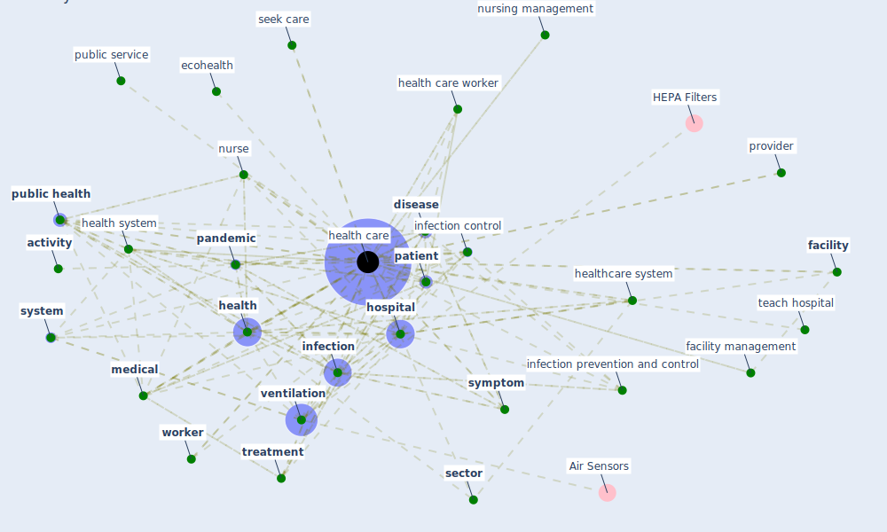

# Keyword: health care

## Keywords

 * [5 g network](keyword_5_g_network), [activity](keyword_activity), administrative datum, community health, [covid-19](keyword_covid-19), [crisis](keyword_crisis), curative, current health, [datum](keyword_datum), demand, [disease](keyword_disease), doctor, ecohealth, [economy](keyword_economy), [education](keyword_education), educational, egypt, emergency department, [employer](keyword_employer), [epidemic](keyword_epidemic), [epidemiological](keyword_epidemiological), [facebook](keyword_facebook), [facility](keyword_facility), [facility management](keyword_facility_management), [finland](keyword_finland), frontline, geneva, head hand and heart, [health](keyword_health), health and well be, [health care](keyword_health_care), health care facility, health care relate project, health care worker, health datum, [health system](keyword_health_system), [healthcare](keyword_healthcare), [healthcare system](keyword_healthcare_system), [hospital](keyword_hospital), [industry](keyword_industry), [infection](keyword_infection), [infection control](keyword_infection_control), [infection prevention and control](keyword_infection_prevention_and_control), life science, lowerincome, [medical](keyword_medical), [nurse](keyword_nurse), nursing management, [pandemic](keyword_pandemic), [patient](keyword_patient), practitioner, [prevention](keyword_prevention), preventive, preventive medicine, process, provider, public good, [public health](keyword_public_health), public health crisis, public health problem, public service, [quality](keyword_quality), quality of health care, remote prediagnosis, remotely, resource, resourcepoor, safe management of waste, [sector](keyword_sector), seek care, set, shortage of health care worker, sick, sick people, [social](keyword_social), [sustainable development goal](keyword_sustainable_development_goal), [symptom](keyword_symptom), [system](keyword_system), teach hospital, [technology](keyword_technology), [teladoc](keyword_teladoc), [telehealth](keyword_telehealth), telehealth telepresence, [telemedicine](keyword_telemedicine), that provide in china, the hill, [treatment](keyword_treatment), treatment compliance, [tuberculosis](keyword_tuberculosis), [united states](keyword_united_states), utilization, [ventilation](keyword_ventilation), veterinary, waste, water sector, welfare, [well be](keyword_well_be), [worker](keyword_worker), [workplace](keyword_workplace), workplace safety

## Mapping

## Neighbours

### Closest articles

* The impact of COVID-19 and strategies for mitigation and suppression in low- and middle-income countries - [LINK](article_walker_impact_2020)
* Supporting Technologies for COVID-19 Prevention: Systemized Review - [LINK](article_zhao_supporting_2022)
* Strengthening resilience: a priority shared by Health 2020 and - [LINK](article_who_strengthening_2017)
* 2020 Data Protection Report - [LINK](article_council_of_europe_2020_2020)
* 2019 Novel Coronavirus (COVID-19) Pandemic: Built Environment Considerations To Reduce Transmission - [LINK](article_dietz_2019_2020)
* Guidelines for Responding to COVID-19 Pandemic: Best Practices, Impacts, and Future Research Directions - [LINK](article_assaad_guidelines_2021)
* A Review on Building Design as a Biomedical System for Preventing COVID-19 Pandemic - [LINK](article_amran_review_2022)
* Emerging Technologies to Combat the COVID-19 Pandemic - [LINK](article_vaishya_emerging_2020)
* Management of the COVID-19 pandemic: challenges, practices, and organizational support - [LINK](article_hossny_management_2022)
* Addressing vulnerability, building resilience: community-based adaptation to vector-borne diseases in the context of global change - [LINK](article_bardosh_addressing_2017)

### Closest BPs

