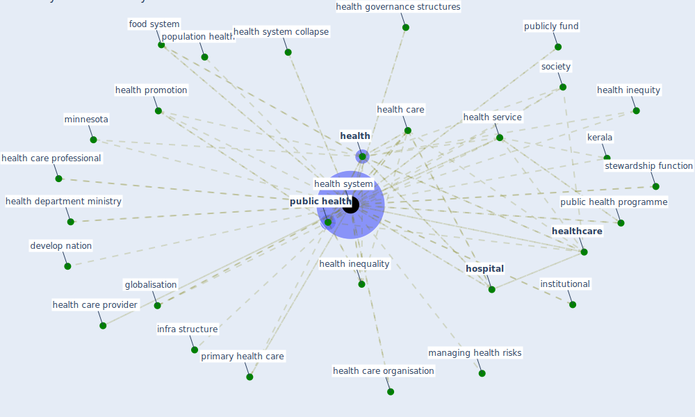

# Keyword: health system

## Keywords

 * [chronic](keyword_chronic), [community](keyword_community), [covid-19](keyword_covid-19), [develop nation](keyword_develop_nation), food, food system, [globalisation](keyword_globalisation), [health](keyword_health), [health care](keyword_health_care), health care organisation, health care professional, health care provider, health department ministry, health governance structures, health in europe, health inequality, health inequity, health promotion, health service, [health system](keyword_health_system), health system collapse, health systems, [healthcare](keyword_healthcare), healthcare facility, healthcare facility require out of pocket expenditure, high patient pressure, [hospital](keyword_hospital), [human health](keyword_human_health), implementing partners, infra structure, institutional, intervention, [kerala](keyword_kerala), keralapeople, managing health risks, [medical](keyword_medical), minnesota, national, overburden everywhere, [pandemic](keyword_pandemic), [patient](keyword_patient), patient sense of control, population health, primary health care, [public health](keyword_public_health), public health policy and practice, public health programme, publicly fund, [resilience](keyword_resilience), singleton agent, [society](keyword_society), society more generally, stewardship function, [surveillance](keyword_surveillance), [system](keyword_system), take a health systems approach, tallinn charter, [vaccination](keyword_vaccination), [virus](keyword_virus)

## Mapping

## Neighbours

### Closest articles

* Strengthening resilience: a priority shared by Health 2020 and - [LINK](article_who_strengthening_2017)
* Addressing vulnerability, building resilience: community-based adaptation to vector-borne diseases in the context of global change - [LINK](article_bardosh_addressing_2017)
* Health, Economic and Social Development Challenges of the COVID-19 Pandemic: Strategies for Multiple and Interconnected Issues - [LINK](article_panneer_health_2022)
* From Viral City to Smart City: Learning from Pandemic Experiences - [LINK](article_sakellarides_viral_2020)
* Amplifying the role of knowledge translation platforms in the COVID-19 pandemic response - [LINK](article_el-jardali_amplifying_2020)
* The COVID-19 pandemic: Lessons on building more equal and sustainable societies - [LINK](article_van_barneveld_covid-19_2020)
* COVID-19: IMPACT OF THE PANDEMIC ON THE SUSTAINABLE DEVELOPMENT GOALS - [LINK](article_samout_covid-19_2020)
* COVID-19 and the UN Sustainable Development Goals: Threat to Solidarity or an Opportunity? - [LINK](article_leal_filho_covid-19_2020)
* COVID-19 Could Leverage a Sustainable Built Environment - [LINK](article_pinheiro_covid-19_2020)
* The impact of COVID-19 and strategies for mitigation and suppression in low- and middle-income countries - [LINK](article_walker_impact_2020)

### Closest BPs

