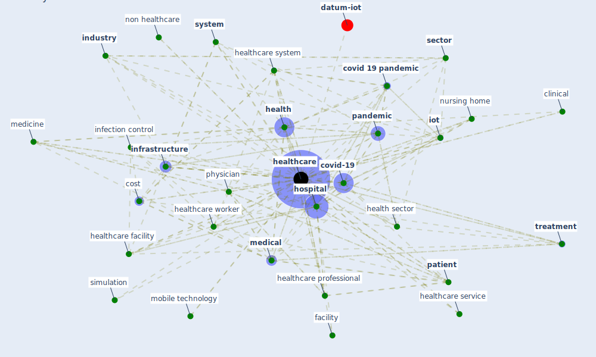

# Keyword: healthcare

* [iot-blockchain](cluster_7)

* [design-ventilation](cluster_12)

## Keywords

 * 11 limitation and challenge of mhealth application, [5 g](keyword_5_g), [access](keyword_access), ai base, [building](keyword_building), [city](keyword_city), [clinical](keyword_clinical), [cost](keyword_cost), cost of healthcare, [covid 19 pandemic](keyword_covid_19_pandemic), [covid-19](keyword_covid-19), [diagnosis](keyword_diagnosis), [domain](keyword_domain), [education](keyword_education), efficient, emergency, emergency department, [facility](keyword_facility), [health](keyword_health), health economic, health insurance, health sector, [health system](keyword_health_system), health worker, [healthcare](keyword_healthcare), healthcare building, healthcare crisis, healthcare facility, healthcare personnel, healthcare professional, healthcare provider, healthcare regulator, healthcare sector, healthcare service, healthcare setting, [healthcare system](keyword_healthcare_system), healthcare team, healthcare waste, healthcare worker, heart monitoring, heating ventilation and air conditioning unit, high risk space, [hospital](keyword_hospital), hospitalization, hygiene, [industry](keyword_industry), [infection](keyword_infection), [infection control](keyword_infection_control), infection control practice, infection prevention, [infrastructure](keyword_infrastructure), instrument, intelligence medicine, [iot](keyword_iot), iot system, liability, light, long term care, longterm care, [machine learning](keyword_machine_learning), [management](keyword_management), mankind, [medical](keyword_medical), medicine, mobile technology, non healthcare, non healthcare facility, nonhealthcare, [nurse](keyword_nurse), nursing home, nutrition, [occupant health](keyword_occupant_health), outpatient, [pandemic](keyword_pandemic), pandemic management, [patient](keyword_patient), patient care, patient center care, physician, physiology, post covid 19, process, [public](keyword_public), quality of life, remote surgery, scientific medicine, [sector](keyword_sector), [service](keyword_service), [simulation](keyword_simulation), [simulation model](keyword_simulation_model), smart wearable, [social](keyword_social), staff, supervision, [system](keyword_system), [telemedicine](keyword_telemedicine), testing, [treatment](keyword_treatment), work facility, [workplace](keyword_workplace)

## Mapping

## Neighbours

### Closest articles

* Impact of COVID-19 on IoT Adoption in Healthcare, Smart Homes, Smart Buildings, Smart Cities, Transportation and Industrial IoT - [LINK](article_umair_impact_2021)
* COVID-19: Risk assessment and mitigation measures in healthcare and non-healthcare workplaces - [LINK](article_fawzy_covid-19_2021)
* A Review on Building Design as a Biomedical System for Preventing COVID-19 Pandemic - [LINK](article_amran_review_2022)
* A Comprehensive Review of the COVID-19 Pandemic and the Role of IoT, Drones, AI, Blockchain, and 5G in Managing its Impact - [LINK](article_chamola_comprehensive_2020)
* The role of 5G for digital healthcare against COVID-19 pandemic: Opportunities and challenges - [LINK](article_siriwardhana_role_2021)
* COVID-19 Prevention and Control Measures in Workplace Settings: A Rapid Review and Meta-Analysis - [LINK](article_ingram_covid-19_2021)
* Mobile Technology Solution for COVID-19: Surveillance and Prevention - [LINK](article_raza_mobile_2021)
* Management of the COVID-19 pandemic: challenges, practices, and organizational support - [LINK](article_hossny_management_2022)
* Digital Twin of COVID-19 Mass Vaccination Centers - [LINK](article_pilati_digital_2021)
* Assessment of Building Automation and Control Systems in Danish Healthcare Facilities in the COVID-19 Era - [LINK](article_pedersen_assessment_2022)

### Closest BPs

