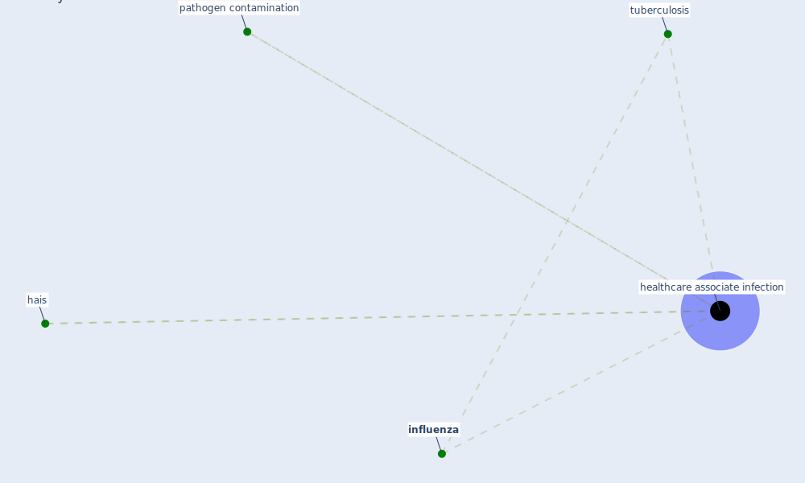

# Keyword: healthcare associate infection

## Keywords

 * [hais](keyword_hais), [healthcare associate infection](keyword_healthcare_associate_infection), healthcare associated infection, healthcare associated infections, [influenza](keyword_influenza), pathogen contamination, [tuberculosis](keyword_tuberculosis)

## Mapping

## Neighbours

### Closest articles

* Case Study: Using Germicidal UV-C to Mitigate COVID-19 - HVAC - [LINK](article_healthcare_facilities_today_case_2021)
* SARS-CoV-2 RNA detection of hospital isolation wards hygiene monitoring during the Coronavirus Disease 2019 outbreak in a Chinese hospital - [LINK](article_wang_sars-cov-2_2020)

### Closest BPs

