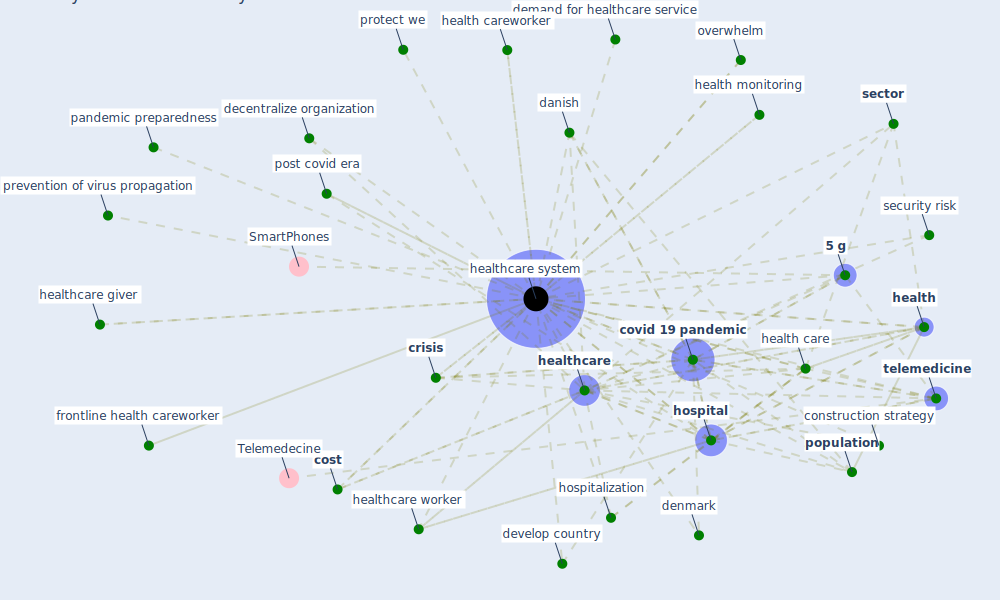

# Keyword: healthcare system

## Keywords

 * [5 g](keyword_5_g), assess the risk, [blockchain](keyword_blockchain), [blockchain technology](keyword_blockchain_technology), [china](keyword_china), construction strategy, [cost](keyword_cost), cost of maintain the healthcare system, [country](keyword_country), covid 19 outbreak, [covid 19 pandemic](keyword_covid_19_pandemic), covid era, [crisis](keyword_crisis), [danish](keyword_danish), decentralize organization, demand for healthcare service, [denmark](keyword_denmark), develop country, efficient, finance, frontline health careworker, [health](keyword_health), [health care](keyword_health_care), health care system, health careworker, health monitoring, [healthcare](keyword_healthcare), healthcare giver, [healthcare system](keyword_healthcare_system), healthcare systems, healthcare worker, [hospital](keyword_hospital), hospitalization, interconnect network, [japan](keyword_japan), [organisation](keyword_organisation), overwhelm, pandemic preparedness, pandemic situation, [population](keyword_population), post covid era, prevention of virus propagation, protect we, public health professional, remote monitoring, remote monitoring of patient health, [risk](keyword_risk), [sector](keyword_sector), security risk, [telemedicine](keyword_telemedicine), worldwide

## Mapping

## Neighbours

### Closest articles

* Leveraging Digital Transformation Technologies to Tackle COVID-19: Proposing a Privacy-First Holistic Framework - [LINK](article_arpaci_leveraging_2021)
* COVID-ABS: An agent-based model of COVID-19 epidemic to simulate health and economic effects of social distancing interventions - [LINK](article_silva_covid-abs_2020)
* Preparing critical infrastructure for the future: Lessons learnt from the Covid-19 pandemic - [LINK](article_tomalska_preparing_2022)
* Contributions of Smart City Solutions and Technologies to Resilience against the COVID-19 Pandemic: A Literature Review - [LINK](article_sharifi_contributions_2021)
* COVID-19 and a new resilient infrastructure landscape - [LINK](article_oecd_covid-19_2021)
* A Comprehensive Review of the COVID-19 Pandemic and the Role of IoT, Drones, AI, Blockchain, and 5G in Managing its Impact - [LINK](article_chamola_comprehensive_2020)
* Assessment of Building Automation and Control Systems in Danish Healthcare Facilities in the COVID-19 Era - [LINK](article_pedersen_assessment_2022)
* Urban planning after COVID-19 - [LINK](article_rtpi_urban_2021)
* Management of the COVID-19 pandemic: challenges, practices, and organizational support - [LINK](article_hossny_management_2022)
* The Role of Architecture and Urbanism in Preventing Pandemics - [LINK](article_kumar_role_2021)

### Closest BPs

