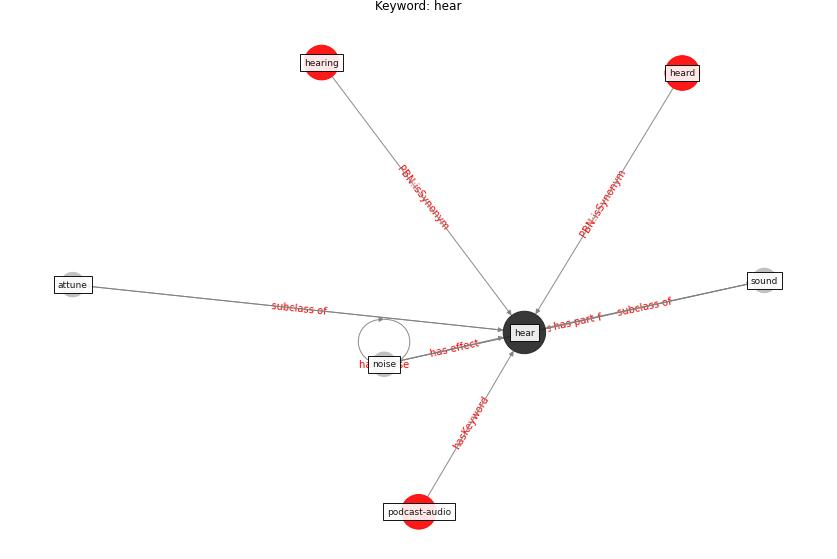

# Keyword: hear

* [podcast-audio](cluster_Cluster_7)

## Keywords

 * Cluster_7, attune, [hear](keyword_hear), heard, hearing, [noise](keyword_noise), [sound](keyword_sound)

## Concepts

 

## Neighbours

### Closest articles

* The City Under COVID‐19: Podcasting As Digital Methodology - [LINK](article_rogers_city_2020)
* Questioning the use of the balcony in apartments during the COVID-19 pandemic process - [LINK](article_aydin_questioning_2020)
* Attitudes towards outdoor and neighbour noise during the COVID-19 lockdown: A case study in London - [LINK](article_lee_attitudes_2021)

### Closest BPs

