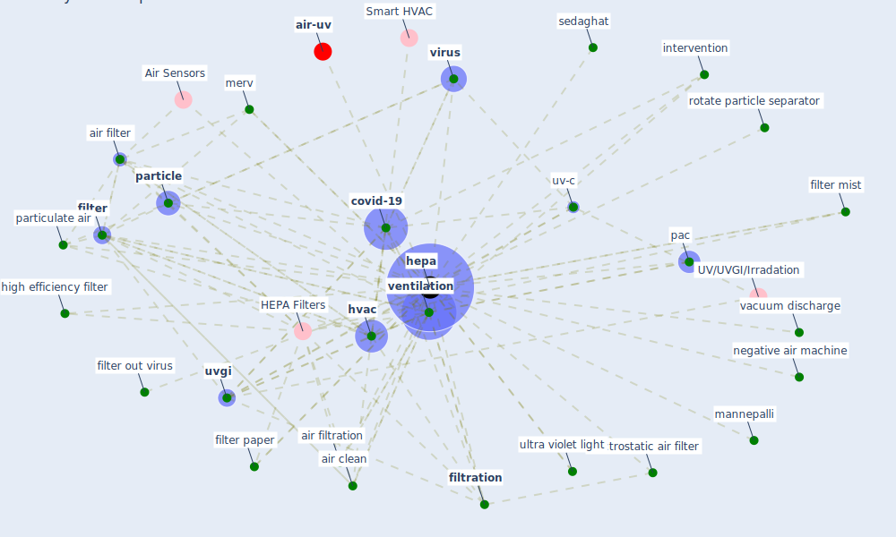

# Keyword: hepa

* [air-uv](cluster_10)

## Keywords

 * Cluster_10, HEPA Filters, aerosol generation, [air](keyword_air), air clean, [air filter](keyword_air_filter), air filtration, [covid-19](keyword_covid-19), electrostatic air filter, [filter](keyword_filter), filter mist, filter out virus, filter paper, [filtration](keyword_filtration), [hepa](keyword_hepa), high efficiency filter, high merv filter, [hvac](keyword_hvac), intervention, mannepalli, merv, [negative air machine](keyword_negative_air_machine), pac, [particle](keyword_particle), particulate air, rotate particle separator, sedaghat, ultra violet light, [uv-c](keyword_uv-c), [uvgi](keyword_uvgi), vacuum discharge, [ventilation](keyword_ventilation), [virus](keyword_virus)

## Mapping

## Neighbours

### Closest articles

* A critical review of heating, ventilation, and air conditioning (HVAC) systems within the context of a global SARS-CoV-2 epidemic - [LINK](article_elsaid_critical_2021)
* A review of facilities management interventions to mitigate respiratory infections in existing buildings - [LINK](article_zhang_review_2022)
* How will COVID-19 change future building regulations? - [LINK](article_hmc_architects_how_2020)
* 2019 Novel Coronavirus (COVID-19) Pandemic: Built Environment Considerations To Reduce Transmission - [LINK](article_dietz_2019_2020)
* ASHRAE Position Document on Infectious Aerosols - [LINK](article_ashrae_ashrae_2022)
* COVID-19 Could Leverage a Sustainable Built Environment - [LINK](article_pinheiro_covid-19_2020)
* The removal of airborne SARS-CoV-2 and other microbial bioaerosols by air filtration on COVID-19 surge units - [LINK](article_conway-morris_removal_2021)
* Review and comparison of HVAC operation guidelines in different countries during the COVID-19 pandemic - [LINK](article_guo_review_2021)
* Effect of Ultraviolet Germicidal Irradiation on Viral Aerosols - [LINK](article_walker_effect_2007)
* Ventilation use in nonmedical settings during COVID-19: Cleaning protocol, maintenance, and recommendations - [LINK](article_nembhard_ventilation_2020)

### Closest BPs

