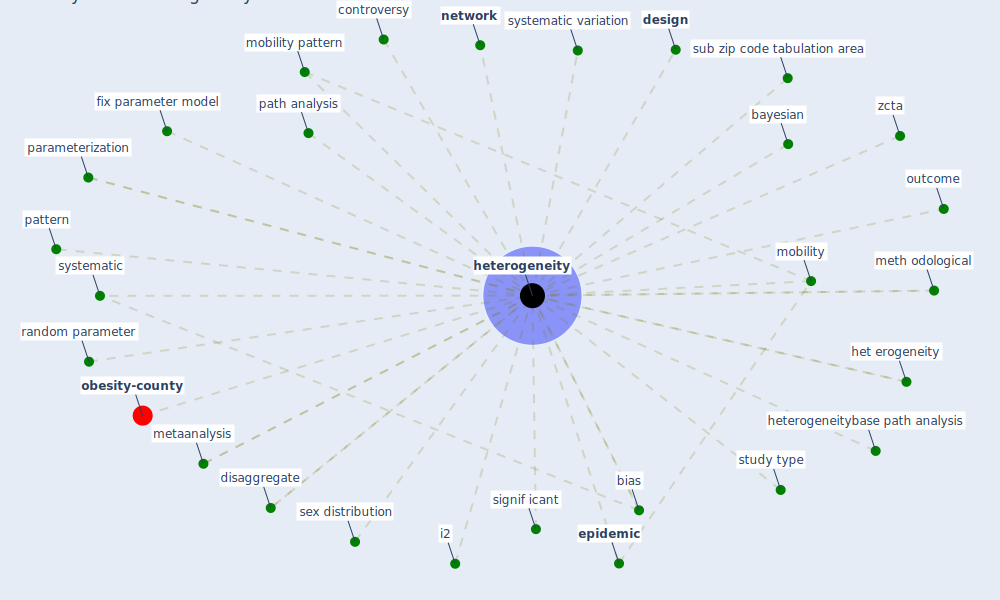

# Keyword: heterogeneity

* [obesity-county](cluster_9)

## Keywords

 * Cluster_9, bayesian, bias, controversy, [design](keyword_design), disaggregate, [epidemic](keyword_epidemic), fix parameter model, het erogeneity, heterogeneities, [heterogeneity](keyword_heterogeneity), heterogeneitybase path analysis, i2, metaanalysis, meth odological, methodological, [mobility](keyword_mobility), mobility pattern, [network](keyword_network), outcome, parameterization, path analysis, pattern, random parameter, sex distribution, signif icant, study type, sub zip code tabulation area, systematic, systematic variation, zcta

## Mapping

## Neighbours

### Closest articles

* Treating two pandemics for the price of one: Chronic and infectious disease impacts of the built and natural environment - [LINK](article_frank_treating_2021)
* COVID-19 Prevention and Control Measures in Workplace Settings: A Rapid Review and Meta-Analysis - [LINK](article_ingram_covid-19_2021)
* Understanding the role of urban design in disease spreading - [LINK](article_brizuela_understanding_2019)
* Challenges of data sharing in European Covid-19 projects: A learning opportunity for advancing pandemic preparedness and response - [LINK](article_tacconelli_challenges_2022)
* Physical interventions to interrupt or reduce the spread of respiratory viruses: systematic review - [LINK](article_jefferson_physical_2008)
* Mitigation strategies and compliance in the COVID-19 fight; how much compliance is enough? - [LINK](article_mukerjee_mitigation_2021)
* EXPOSED: An occupant exposure model for confined spaces to retrofit crowd models during a pandemic - [LINK](article_ronchi_exposed_2020)
* Urban design attributes and resilience: COVID-19 evidence from New York City - [LINK](article_yang_urban_2021)
* The effect of human mobility and control measures on the COVID-19 epidemic in China - [LINK](article_kraemer_effect_2020)

### Closest BPs

