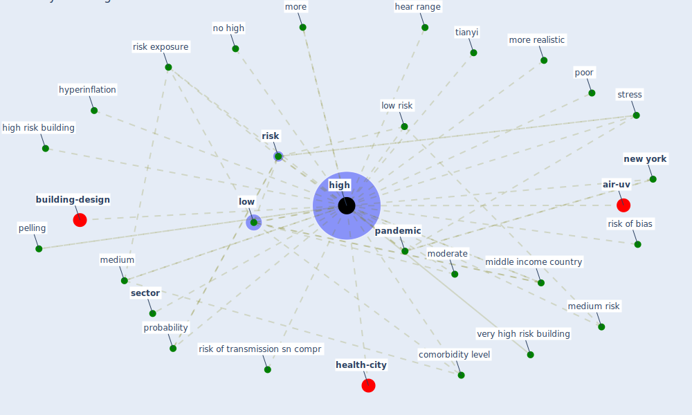

# Keyword: high

* [filter-air](cluster_0)

## Keywords

 * Cluster_0, campolindo, cbe sector, comorbidity, comorbidity level, [covid-19](keyword_covid-19), evidence standard, hear range, [high](keyword_high), high cost of borrow, high risk building, high subj, higher, highest, hyperinflation, impulsivity, j j high, [low](keyword_low), low cci, low density, low risk, [medium](keyword_medium), medium risk, middle income country, moderate, more, more realistic, [new york](keyword_new_york), no high, [pandemic](keyword_pandemic), pelling, poor, probability, [risk](keyword_risk), risk exposure, risk of bias, risk of transmission sn compr, [sector](keyword_sector), [stress](keyword_stress), tianyi, very high risk building, yes no high

## Mapping

## Neighbours

### Closest articles

* A Global Survey of Infection Control and Mitigation Measures for Combating the Transmission of COVID-19 Pandemic in Buildings Under Facilities Management Services - [LINK](article_sarvari_global_2022)
* World Bank Development Report - [LINK](article_world_bank_world_2022)
* Revisiting the built environment: 10 potential development changes and paradigm shifts due to COVID-19 - [LINK](article_cheshmehzangi_revisiting_2021)
* The Intelligent Lockdown: Compliance with COVID-19 Mitigation Measures in the Netherlands - [LINK](article_kuiper_intelligent_2020)
* Mental health economics: A prospective study on psychological flourishing and associations with healthcare costs and sickness benefit transfers in Denmark - [LINK](article_santini_mental_2021)
* COVID-19 Lockdown: Housing Built Environment’s Effects on Mental Health - [LINK](article_amerio_covid-19_2020)
* Effects of temperature and humidity on the spread of COVID-19: A systematic review - [LINK](article_mecenas_effects_2020)
* Architectural Design Drives the Biogeography of Indoor Bacterial Communities - [LINK](article_kembel_architectural_2014)
* Review and comparison of HVAC operation guidelines in different countries during the COVID-19 pandemic - [LINK](article_guo_review_2021)
* Study of COVID-19 pandemic in London (UK) from urban context - [LINK](article_ghosh_study_2020)

### Closest BPs

