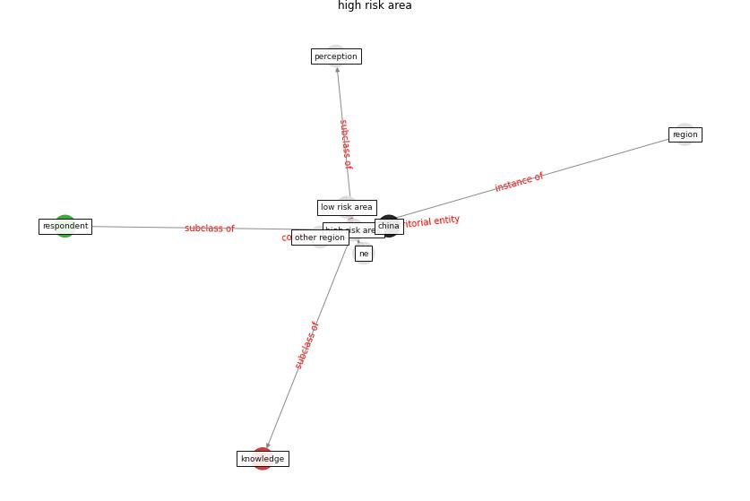

# Keyword: __high risk area__

## Concepts

 

## Top articles for __high risk area__
* Aerosol and Surface Distribution of Severe Acute
Respiratory Syndrome Coronavirus 2 in Hospital
Wards, Wuhan, China, 2020 ([guo_aerosol_2020](article_guo_aerosol_2020))
* The impacts of knowledge, risk perception, emotion and
information on citizens’ protective behaviors during the
outbreak of COVID-19: a cross-sectional study in
China ([ning_impacts_2020](article_ning_impacts_2020))
