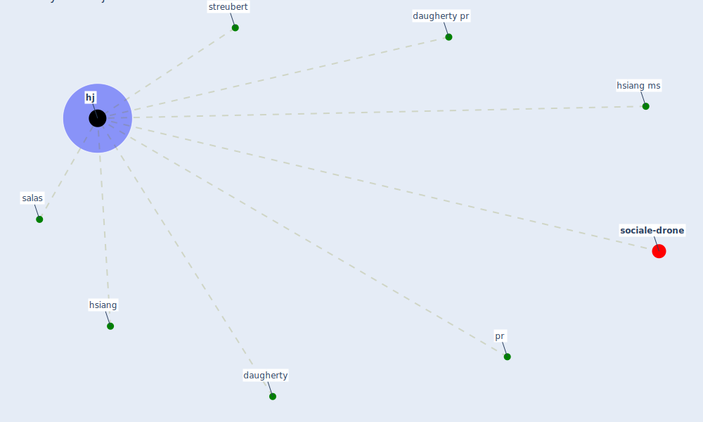

# Keyword: hj

* [sociale-drone](cluster_6)

## Keywords

 * Cluster_6, daugherty, daugherty pr, [hj](keyword_hj), hsiang, hsiang ms, pr, salas, streubert

## Mapping

## Neighbours

### Closest articles

* From Viral City to Smart City: Learning from Pandemic Experiences - [LINK](article_sakellarides_viral_2020)
* Integrating rapid risk mapping and mobile phone call record data for strategic malaria elimination planning - [LINK](article_tatem_integrating_2014)
* Management of the COVID-19 pandemic: challenges, practices, and organizational support - [LINK](article_hossny_management_2022)
* Making green infrastructure healthier infrastructure - [LINK](article_lohmus_making_2015)

### Closest BPs

