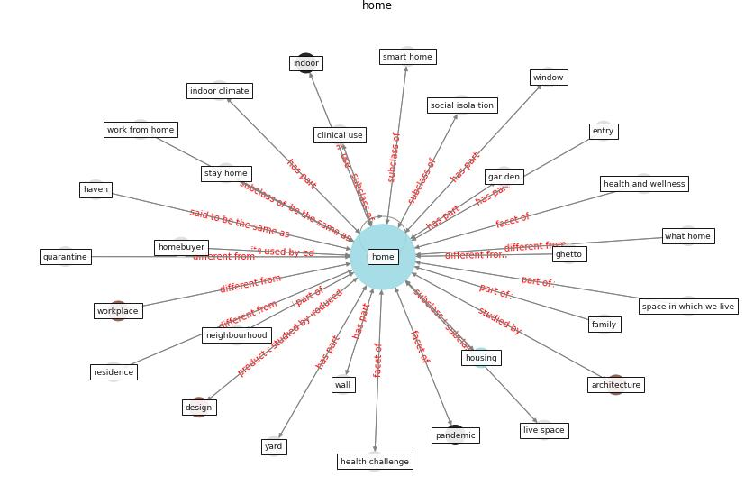

# Keyword: home

* [building-space](cluster_Cluster_9)

## Keywords

 * accessible green roof, [apartment](keyword_apartment), [architect](keyword_architect), [architectural design](keyword_architectural_design), [architecture](keyword_architecture), bathroom, behind close door, [build](keyword_build), [build environment](keyword_build_environment), [building](keyword_building), [city](keyword_city), clinical use, commercial building, [community](keyword_community), day care, daylighte in the home, [design](keyword_design), domestic space, dream of, economic analysis, entry, [environment](keyword_environment), exist home, existence, extra bedroom, family, family zone, feel, fixture and fitting, floor plan, floor plan draw, gar den, geography of harm, ghetto, haven, [home](keyword_home), home meblinde, home office, home space, homebuyer, [homelessness](keyword_homelessness), homework, [house](keyword_house), [housing](keyword_housing), housing research, [hvac](keyword_hvac), [indoor](keyword_indoor), [indoor climate](keyword_indoor_climate), [infrastructure](keyword_infrastructure), job, kitchen, life, live environment, live space, living place, living quarter, living room, [lockdown](keyword_lockdown), meeting place, mini paradise, nation, naturally ventilate, near and safe, neighbourhood, [occupant](keyword_occupant), [office](keyword_office), other place, outdoor space, [pandemic](keyword_pandemic), physical framework, place, playground, public building, [quarantine](keyword_quarantine), quarantine residence, ready, renovation, residence, residential, residential design, safe haven, single family, single family house, smart home, social isola tion, solar generation, [space](keyword_space), space in which we live, stay home, [sustainable architecture](keyword_sustainable_architecture), wall, what home, [window](keyword_window), [work](keyword_work), work from home, work place, work study, work the square, [workplace](keyword_workplace), yard

## Concepts

 

## Neighbours

### Closest articles

* Prophylactic Architecture: Formulating the Concept of Pandemic-Resilient Homes - [LINK](article_elrayies_prophylactic_2022)
* A Mixed Approach on Resilience of Spanish Dwellings and Households during COVID-19 Lockdown - [LINK](article_cuerdo-vilches_mixed_2020)
* COVID-19 and Green Housing: A Review of Relevant Literature - [LINK](article_kaklauskas_covid-19_2021)
* Dangerous liaisons? Applying the social harm perspective to the social inequality, housing and health trifecta during the Covid-19 pandemic - [LINK](article_gurney_dangerous_2021)
* How our homes impact our health: using a COVID-19 informed approach to examine urban apartment housing - [LINK](article_peters_how_2020)
* Impacts of COVID-19 on residential building energy use and performance - [LINK](article_kawka_impacts_2021)
* How is COVID-19 Experience Transforming Sustainability Requirements of Residential Buildings? A Review - [LINK](article_tokazhanov_how_2020)
* The role of green roofs in post COVID-19 confinement: An analysis of willingness to pay - [LINK](article_manso_role_2021)
* Houses amid COVID-19: Environmental challenges and design adaptation - [LINK](article_hizra_houses_2021)

### Closest BPs

