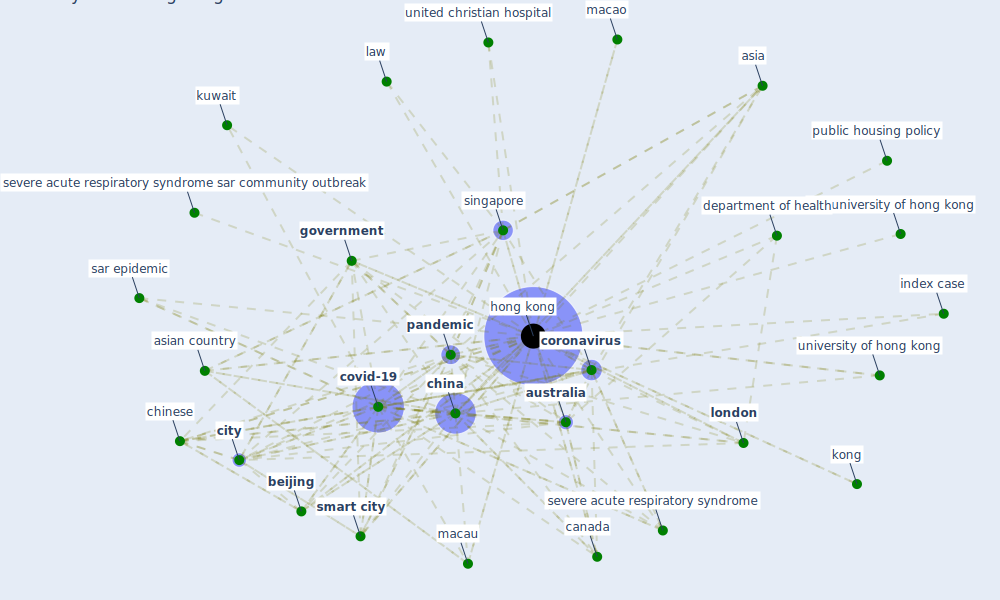

# Keyword: hong kong

## Keywords

 * 2003 sar epidemic, 5 centre for health protection, I will never go to hong kong, I will never go to hong kong again, [air pollution](keyword_air_pollution), amoy garden, asia, asian country, [australia](keyword_australia), [beijing](keyword_beijing), [build](keyword_build), [canada](keyword_canada), canadian, [china](keyword_china), [chinese](keyword_chinese), citizen, [city](keyword_city), [coronavirus](keyword_coronavirus), covid 19 epidemic, [covid 19 pandemic](keyword_covid_19_pandemic), [covid-19](keyword_covid-19), daylighte, department of health, electronic payment, gary liu, gary liu 6, [government](keyword_government), habitat, habitat int ng, health and safety condition, [hong kong](keyword_hong_kong), hong kong government, [index case](keyword_index_case), istanbul, [japan](keyword_japan), kitchen, kong, kuala lumpur, [kuwait](keyword_kuwait), [law](keyword_law), [london](keyword_london), macao, macau, [new york](keyword_new_york), [new york city](keyword_new_york_city), onew45, [pandemic](keyword_pandemic), prefabrication in building, prince of waleshospital, protest, protester, [public housing](keyword_public_housing), public housing policy, relative humidity, research grant council, [resident](keyword_resident), [rh](keyword_rh), sar 2002 2003 outbreak, sar epidemic, sar epidemic in hong kong, [sar outbreak](keyword_sar_outbreak), sars virus, severe acute respiratory syndrome, severe acute respiratory syndrome sar community outbreak, shiu hung lee, sick building syndrome, singapore, [smart city](keyword_smart_city), [survey](keyword_survey), the university of hong kong, tourist behavior, tsui h, united christian hospital, [united kingdom](keyword_united_kingdom), [university of hong kong](keyword_university_of_hong_kong), urban development, urban development be at a very high density, urban park, urban parks in hong kong, urban place, urban place at scale, v w tam, [ventilation](keyword_ventilation), [wong](keyword_wong), [wtp](keyword_wtp), wtp for green roof

## Mapping

## Neighbours

### Closest articles

*  - [LINK](article_mehtab_alam_role_2021)
* Seeing the invisible hand: Underlying effects of COVID-19 on tourists’ behavioral patterns - [LINK](article_li_seeing_2020)
* World Bank Development Report - [LINK](article_world_bank_world_2022)
* The impacts of knowledge, risk perception, emotion and information on citizens’ protective behaviors during the outbreak of COVID-19: a cross-sectional study in China - [LINK](article_ning_impacts_2020)
* How COVID-19 Could Accelerate the Adoption of New Retail Technologies and Enhance the (E-)Servicescape - [LINK](article_willems_how_2021)
* Assessment of COVID-19 precautionary measures in sports facilities: A case study on a health club in Saudi Arabia - [LINK](article_ibrahim_assessment_2022)
* Health, Wellbeing \& Productivity in Offices - [LINK](article_world_green_building_council_health_2014)
* Coronavirus questions that will not go away: interrogating urban and socio-spatial implications of COVID-19 measures - [LINK](article_salama_coronavirus_2020)
* Global value chains: Efficiency and risks in the context of COVID-19 - [LINK](article_oecd_global_2021)
* Toilets dominate environmental detection of SARS-CoV-2 virus in a hospital - [LINK](article_ding_toilets_2020)

### Closest BPs

